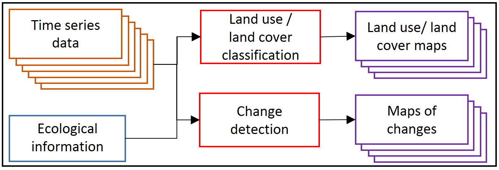
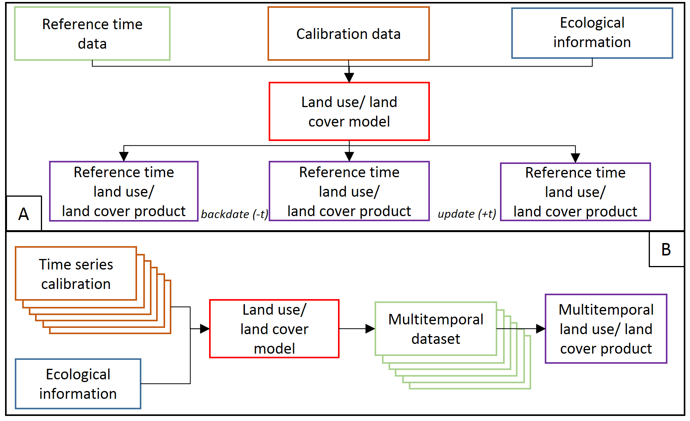
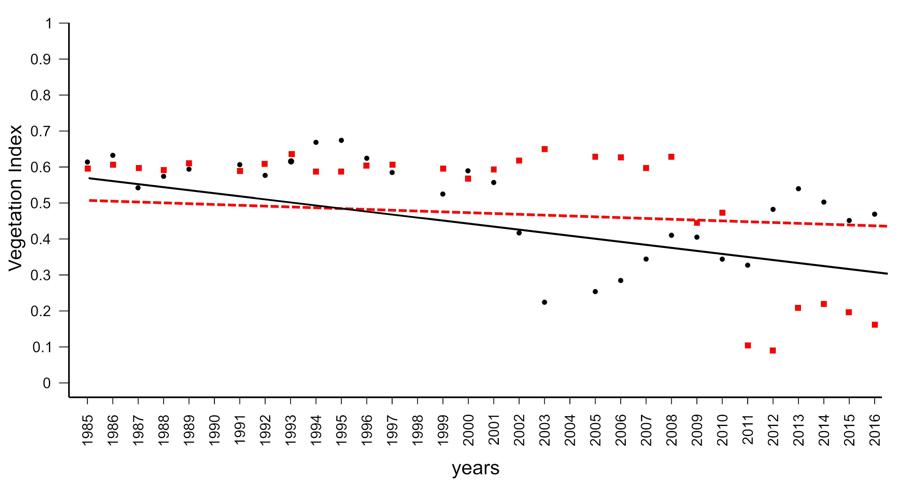
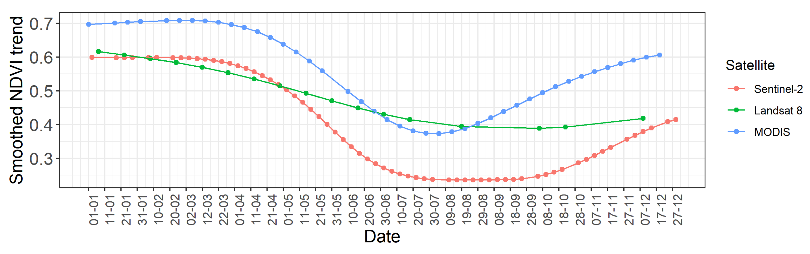

## Prerequisites

For working on this theme, you need:  
- basic R skills  
- R packages -TODO: Module 2 R environment/project setup tutorial-

# Temporal information in satellite data

As you know from the previous theme, no other level of data acquisition
allows for analysis at regular intervals from the beginning of work of
the instrument than the satellite level. This results in a collection of
**huge amounts of data**, e.g. Landsat has collected more than 8 million
scenes of Earth since the start of the mission. So here we would like to
present the potential of the multitemporal aspect of a large volume of
such data in Earth observation analysis.

## Objectives

After reading through theoretical contents this theme you will learn how
to:  
- [indicate satellite sensors with high or low temporal
resolution](#resolution)  
- [recognize the types of multitemporal analysis](#temporal-analysis)  
- [list key aspects of satellite time series data analysis](#aspects)  
- [divide satellite data into categories depending on temporal
resolution](#monitoring)  
- [define different types of changes on satellite data](#changes)  
- [address uncertainty in the results](#uncertainty)  
- [differentiate several change detection algorithms](#methods)

After performing the [exercise](#exercise) in this theme you will be
able to: - identify date of change based on visual image interpretation
and spectral indices values  
- recognise change agents based on spectral indices values  
- recreate presented steps to prepare your own reference dataset

## Temporal resolution of selected sensors

The temporal resolution of satellite data from different sensors depends
on the type of orbit on which the satellite is placed. Geostationary
satellite systems continuously acquire images of the same part of the
globe, so multiple data acquisitions can occur even on the same day or
even within a few minutes. Examples of such systems are meteorological
satellites such as Meteosat and NOAA. Another class of satellites
includes systems orbiting in polar orbits, like Landsat or SPOT
missions. In their case, time resolution is defined as the time the
satellite revisits the same part of a given area. Typically, it takes
between one day and half a month for a satellite in polar orbit to make
another acquisition. This time can be reduced by placing several
satellites with twin sensor parameters in the same polar orbit, like in
case of Sentinel-2.

Overview of temporal resolution of selected satellite sensors is
presented in **Figure 1** below.

<b>Figure 1. Temporal resolution and lifetime of selected satellite
missions.</b>

## Types of temporal analysis

The temporal aspect is of particular importance in the case of satellite
data acquired continuously. Temporal analysis can be divided into
multitemporal classification and change detection (**Figure 2**). We
address the examples of such analyses in [Theme
4](../04_multitemporal_classification/04_multitemporal_classification.md)
and [Theme 5](../05_vegetation_monitoring/05_vegetation_monitoring.md)
of this Module, respectively.

<b>Figure 2. Temporal analysis on satellite time series data.</b>

In the first one we can consider two kinds of products obtained. In
**Figure 3A** a base map representing reference date conditions for a
single term is created, and then it can be updated/backdated with change
information from the time series (**Figure 3A**). The use of
multitemporal dataset into one land cover model is to improve the
accuracy relative to single term results (**Figure 3B**).

<b>Figure 3. Time series data based classification (based on Gómez et
al. 2016, modified).</b>

A key step in the change detection is the direct comparison of two or
more images acquired at different dates. Images can be analysed using an
algorithm based on selected remote sensing variables, such as, single
spectral bands, vegetation indices, the biophysical parameters of
vegetation etc or on post-classification image. The result is a map of
changes showing their direction or magnitude. One important aspect of
temporal analysis is related to the category of time series of satellite
data that can be considered **online / offline** ([Zhu, 2017](#)). The
first one assumes the time series data are coming in at a certain rate -
analyses are provided in near real-time or continuously, and the second
one assumes that the time series data already exist. In both
multitemporal classification and change detection both categories are
possible to use, however, the important thing is to indicate the
checkpoint connected to the start of the satellite mission which allows
for retrospective analyses. As it can be seen in Figure 1 the Landsat
plays an important role here, as it is the longest time series of
civilian optical satellite data. After opening the archives in 2008 all
new and archived images have been made freely available over the
internet to any user ([Wulder et al. 2012](#)).

### Aspects of satellite time series data analysis

The analysis on satellite time series data can be divided into four key
aspects, like: - frequencies - directly related to temporal resolution
of satellite data (e.g. for Landsat 5-8 the revisit time over the same
area is 16 days, which allows for obtaining 22-23 images per year, for
Sentinel-2 collected with 5-day frequency it will be 73 images),  
- preprocessing - including radiometric correction, cloud/shadow
detection, composite/fusion, metrics calculation etc. (see [Theme
3]((../03_image_processing/03_image_processing.md))),  
- methods - the algorithms useful for multitemporal classification or
change detection (see the [appropriate section in this
Theme](#methods)), - applications - wide range of use of time series for
environmental analyses (the examples in [Theme
4](../04_multitemporal_classification/04_multitemporal_classification.md)
and [Theme 5](../05_vegetation_monitoring/05_vegetation_monitoring.md)).

### Temporal categories of time series data

Depending on temporal resolution of satellite data and its time range
multitemporal analysis can be divided in following categories: -
**intra-annual** - analysed data are acquired within the same year
(e.g. analysis of phenological changes in one season),  
- \*\*inter-annual (year-to-year\*)** - analysed data are acquired in
two different years with any interval (e.g. analysis of the hurricane or
flood effects),  
- **inter-annual (multi-year)\*\* - analysed data are acquired in more
than two different years with any interval (e.g. analysis of the pest
infestation or climate change effects). Depending on these categories,
satellite data can be defined as long and / or dense time series data.
They can be used separately or combined depending on the purpose of the
analysis.

Depending on these categories, satellite data can be defined as **long**
and / or **dense time series data**. They can be used separately or
combined depending on the purpose of the analysis.

## Types of changes on satellite data

#### Abrupt and gradual changes

The possibility to detect changes based on satellite data depends on the
system capacity to account for variability at different temporal scales
mentioned above. As such, temporal-scale changes can be **abrupt** and
**gradual** (**Figure 4**), where the first one refers to short-term,
large magnitude, and the second one refers to long-term, small magnitude
date-to-date changes ([Zhu, 2017](#)). Abrupt changes can be caused by
disturbance agents such as fires, floods or deforestation. Gradual
changes can be caused by climate changes or land management.

<b>Figure 4. Example trends for two Landsat data series with abrupt
(black dots) and gradual (red squares) changes occurrence. The trends
show long-term changes in the vegetation index values (Ochtyra et al.,
2020).</b>

#### Seasonal changes

There are also **seasonal** changes, driven by annual temperature and
rainfall interactions impacting plant phenology or proportional cover of
land cover types with different phenology of vegetation ([Verbesselt et
al. 2010](#)). In this kind of analyses the changes between images can
be considered as detected seasonal metric/parameter connected to the
vegetation behaviour in a given time, e.g. start, peak or end of the
growing season (**Figure 5**).

<b>Figure 5. Seasonality parameters: (a) beginning of season, (b) end of
season, (c) length of season, (d) base value, (e) time of middle of
season, (f) maximum value, (g) amplitude, (h) small integrated value,
(h+i) large integrated value (Jönsson, Eklundh, 2004). The red and blue
lines are filtered and original data, respectively. </b>

## Monitoring of change types and difference in spectral trajectory in time series

Extraction of change from time series of satellite data is not
straightforward because it consists of seasonal, gradual and abrupt
changes and is additionally affected by clouds, haze, aerosols,
illumination differences, or geometric inconsistency. In order to detect
changes as accurately as possible, it is very important to select data
with **resolutions that best investigate the phenomenon under study**.
Then these additional factors need to be eliminated. Based on each pixel
in the time series we can analyse the trend over time and the
relationship between the factors which is defined as **spectral
trajectory** analysis.

<b>Figure 6. NDVI trends derived from different sensors: Sentinel-2,
Landsat 8 and MODIS (please note that the study area is located in the
southern hemisphere, Kavats et al. 2020).</b>

In order to capture the stages of plant development in **phenological
change** detection, the highest possible time resolution of the
inter-annual data, at most every few days, is most desirable. The
spatial resolution is important here, as meteorological image data are
most often collected (several times a day), but their pixel size
(greater than 1 km) limits the possibility of extracting only areas
covered with vegetation. The spectral ranges most frequently used in
such analyses are visible light, near and shortwave infrared, however,
apart from using the original reflectance values, information from more
than one band is often combined to enhance the plant properties. The
most commonly used index is NDVI being a good indicator for vegetation
phenology. MODIS data can outperform Landsat highlighting the importance
of higher temporal resolution needed to phenological change detection,
even if the spatial resolution is lower. New possibilities are created
by the Sentinel-2 constellation, providing a relatively small pixel
size, useful spectral bands as well as a quite fast revisit time thanks
to double data acquisition from Sentinel-2A and Sentinel-2B satellites.
The only limitation may be cloudiness. To improve the temporal and
spatial resolution of single sensors alone they are harmonised or fused
together (e.g. Landsat 8 with Sentinel-2, or Landsat with MODIS etc.). A
better understanding of the separate and combined capabilities of two
sensors can help in improving the obtained results over spatial-temporal
domains.

Such high temporal resolution is not necessary in **abrupt changes**
detection in the long-term perspective (intra-annual). As they can be
caused by e.g. deforestation, their sudden nature will appear as a rapid
drop in the reflectance or index value, so high spectral resolution is
not a key requirement here. It is more important that the sensor has
spectral bands that best show the phenomenon under study. Landsat data
16-day revisit time can be enough to indicate such “big” change. As most
often abrupt changes concern larger areas than gradual changes
(e.g. pest gradations), the highest possible spatial resolution is also
not required. For **gradual changes** the measured differences between
subsequent images will be less pronounced so more details in spectral
and spatial domain will be key factors affecting obtained accuracy of
change detection. A more dense time series of data will allow for a more
detailed analysis of the trend, with a low frequency it could be a
difficulty in identifying the actual change.

## Uncertainty of change analysis

With a high degree of probability one can assume that a change detection
image based on satellite images acquired on different dates will consist
of many pixels or segments, which would be changed from the starting
point, whether on the original reflectance image or post-classification
image. Any detectable change can be further attributed. However, there
are many factors which could influence whether the changes user will
observe can actually be connected with real on the ground change and the
probability of occurrence of such change (example of multitemporal
classification probability in **Figure 7**). Uncertainty of change
analysis describes **magnitude of errors**, their **spatial patterns**
and can help the end user to better understand **strengths and
limitations** of the data ([Povey, Grainger 2015](#)).

<b>Figure 7. Probability of pixels being correctly classified on
multitemporal images (Koukoulas 2010, modified).</b>

To start with, every analysis should be preceded by thorough **input
data assessment** in terms of factors that could potentially influence
results of change detection analysis. These factors may include sun and
atmospheric effects on imagery, terrain topography and stage of the
phenological cycle ([Song, Woodcock 2003](#)). Furthermore, errors and
omissions on the processing stage (such as different types of
corrections, transformations, harmonisations) can also affect the degree
of accuracy in detecting changes, their causes and therefore the final
appearance of the post-processing image. Finally, attributing any given
pixel with ‘Change’ or ‘No Change’ label is usually preceded by
e.g. thresholding or trajectory classification (see the [next
section](#methods)). Such methods, however, are limited by their lack of
robustness over different research areas and obliviousness to rate and
severity of changes.

Post-results analysis of change detection algorithms should be preceded
by thorough **accuracy and error assessment** of the change image. Most
common sample-based accuracy metrics used in remote sensing, such as
overall accuracy, producer’s accuracy, user’s accuracy and Kappa
coefficient can be used as a basis for determining the degree of
uncertainty. The preceding step, together with visual image assessment,
should allow the user to evaluate **spatial distribution of errors** and
**magnitude** of their occurrence. Should one notice **spatial patterns
in error distribution**, the results can either be modified by for
example inclusion of samples from areas with higher error rates or, in
case the former step is not possible or unsuccessful, attaching
confidence interval or standard error to the result ([Koukoulas
2010](#)). In sample-based accuracy assessment such measures are in fact
representing the level of uncertainty. Research shows that
error-adjusted estimates may differ significantly from raw accuracy
measures ([Olofsson et al. 2013](#)). The inclusion of a confidence
interval allows the uncertainty to be quantified. Taking the steps above
should allow the end user of the classification to make more informed
decisions about further use of the results.

## Methods - tools and algorithms

The temporal resolution and repeatability of satellite data acquisition
allows the development of special tools and algorithms for specific
multitemporal analyses. Before the use of a particular algorithm it is
necessary to **characterise the quality of data** and **indicate the
moment and change agent** on the multitemporal dataset in the analysed
area. In Module 1, you have already learned about the **GEE Time Series
Explorer** plugin, with which you can explore satellite data time
series. [Cohen et al. (2010)](#) introduced [TimeSync](#) - a Landsat
time series visualisation tool that can be used to collect the data and
derive plot-based estimates of change (Figure 8). You will know a
similar solution in the [Exercise](#exercise) at the end of this Theme,
which will be very useful for validation of the results obtained using
any change detection algorithm.

<b>Figure 8. Landsat image chips (1985-2007) displayed in TimeSync tool
(A) and corresponding trajectory window with Tasseled Cap Wetness index
values (B).</b>

While in multitemporal classification of satellite data the algorithms
are independent on the use of one, two or hundreds of images and they
can be commonly used clustering, semi- or supervised algorithms
(e.g. k-means, Neural Networks, Support Vector Machines), in change
detection application numerous specific algorithms and tools were
proposed by the authors.

From a mathematical point of view the change can be extracted via six
approaches ([Zhu, 2017](#)): - **thresholding** - indicating significant
deviation from the predefined threshold,  
- **differencing** - indicating large differences in comparing images
from different terms,  
- **segmentation** - segmenting the time series into a series of
straight line segments based on the residual-error and angle
criterions,  
- **trajectory classification** - from hypothesised trajectories
representing signatures specific to different kinds of changes or from
multi-date supervised classification,  
- **statistical boundary** - indicating significant departure from the
statistical boundary followed by time series,  
- **regression** - estimating the long-term movements or trends in time
series.

Change detection algorithms are based on one of these or combined.
Except for the possibility of detecting specific change types using
satellite data time series, there are also algorithms **dedicated to a
specific issue** e.g. forest disturbances (see [Theme
5](../05_vegetation_monitoring/05_vegetation_monitoring.md))). **Table
2** presents selected algorithms developed for change detection analysis
with the information about change type possible to detect on satellite
time series data.

|                                 Algorithm                                  |        Change type        |             Reference              |
|:--------------------------------------------------------------------------:|:-------------------------:|:----------------------------------:|
|               Breaks For Additive Seasonal and Trend (BFAST)               | abrupt, gradual, seasonal |    [Verbesselt et al., 2010](#)    |
|           Continuous Change Detection and Classification (CCDC)            | abrupt, gradual, seasonal |      [Zhu, Woodcock, 2014](#)      |
|              COntinuous monitoring of Land Disturbance (COLD)              |      abrupt, gradual      |       [Zhu et al., 2020](#)        |
|       Detecting Breakpoints and Estimating Segments in Trend (DBEST)       | abrupt, gradual, seasonal |      [Jamali et al., 2015](#)      |
|      Exponentially Weighted Moving Average Change Detection (EWMACD)       |          abrupt           |      [Brooks et al., 2014](#)      |
|               Harmonic Analyses of NDVI Time-Series (HANTS)                |         seasonal          |       [Zhou et al., 2015](#)       |
|                    Jumps Upon Spectrum and Trend (JUST)                    | abrupt, gradual, seasonal | [Ghaderpour, Vujadinovic, 2020](#) |
| Landsat-based detection of Trends in Disturbance and Recovery (LandTrendr) |      abrupt, gradual      |     [Kennedy et al., 2010](#)      |
|               Phenological parameters estimation tool (PPET)               |         seasonal          |     [McKellip et al., 2010](#)     |
|                  Seasonal trend decomposition Loess (STL)                  |         seasonal          |    [Cleveland et al., 1990](#)     |
|                Sub-annual change detection algorithm (SCD)                 |          abrupt           |        [Cai, Liu, 2015](#)         |
| Threshold- and trend-based vegetation change monitoring algorithm (TVCMA)  |      abrupt, gradual      |     [Ochtyra et al., 2020](#)      |
|                                 TimeStats                                  |         seasonal          |        [Udelhoven, 2011](#)        |
|   Time-Series Classification approach based on Change Detection (TSCCD)    |      abrupt, gradual      |        [Yan et al. 2019](#)        |
|                      Vegetation Change Tracker (VCT)                       |          abrupt           |      [Huang et al., 2010](#)       |
|  Vegetation Regeneration and Disturbance Estimates Through Time (VeRDET)   |      abrupt, gradual      |      [Hughes et al., 2017](#)      |

## Exercise

Assigning change agent to the spectral trajectory in
[QGIS](../../software/software_qgis.md).

### Next unit

Proceed with [Image processing
workflow](../03_image_processing/03_image_processing.md)
