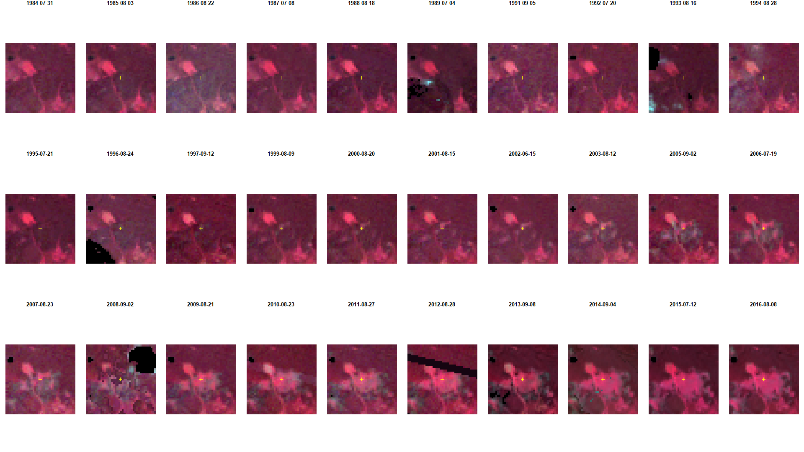
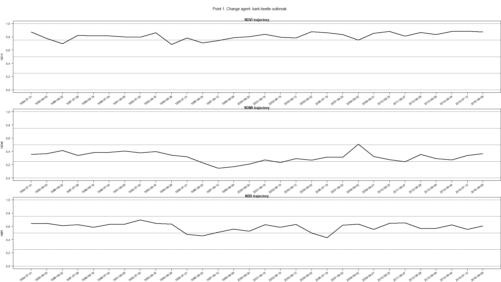
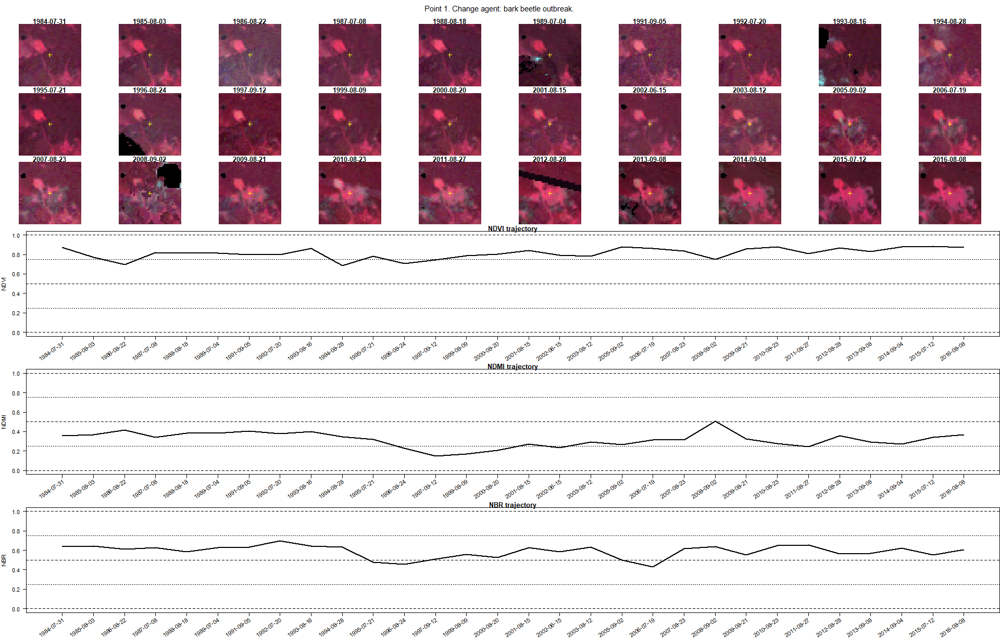

## Prerequisites

For working on this theme, you need:  
- basic R skills  
- R packages -TODO: Module 2 R environment/project setup tutorial-

# Temporal information in satellite data

As you know from the previous theme, no other level of data acquisition
allows for analysis at regular intervals from the beginning of work of
the instrument than the satellite level. This results in a collection of
**huge amounts of data**, e.g. Landsat has collected more than 8 million
scenes of Earth since the start of the mission. So here we would like to
present the potential of the multitemporal aspect of a large volume of
such data in Earth observation analysis.

## Objectives

After reading through theoretical contents this theme you will learn how
to:  
- [indicate satellite sensors with high or low temporal
resolution](#temporal-resolution-of-selected-sensors)  
- [recognize the types of multitemporal
analysis](#types-of-temporal-analysis)  
- [list key aspects of satellite time series data
analysis](#aspects-of-satellite-time-series-data-analysis)  
- [define different types of changes on satellite
data](#types-of-changes-on-satellite-data)  
- [divide satellite data into categories depending on temporal
resolution](#monitoring-of-changes---spectral-trajectory-in-time-series)  
- [address uncertainty in the
results](#uncertainty-of-change-analysis)  
- [differentiate several change detection
algorithms](#methods---tools-and-algorithms)

After performing the
[Exercise](#exercise---change-moments-and-agents-in-tatra-mountains) in
this theme you will be able to:  
- identify date of change based on visual image interpretation and
spectral indices values  
- recognise change agents based on spectral indices values  
- recreate presented steps to prepare your own reference dataset

## Temporal resolution of selected sensors

The temporal resolution of satellite data from different sensors depends
on the type of orbit on which the satellite is placed. Geostationary
satellite systems continuously acquire images of the same part of the
globe, so multiple data acquisitions can occur even on the same day or
even within a few minutes. Examples of such systems are meteorological
satellites such as Meteosat and NOAA. Another class of satellites
includes systems orbiting in polar orbits, like Landsat or SPOT
missions. In their case, time resolution is defined as the time the
satellite revisits the same part of a given area. Typically, it takes
between one day and half a month for a satellite in polar orbit to make
another acquisition. This time can be reduced by placing several
satellites with twin sensor parameters in the same polar orbit, like in
case of Sentinel-2.

Overview of temporal resolution of selected satellite sensors is
presented in **Figure 1** below.


<div align="center">

<b>Figure 1. Temporal resolution and lifetime of selected satellite
missions.</b>

</div>

## Types of temporal analysis

The temporal aspect is of particular importance in the case of satellite
data acquired continuously. Temporal analysis can be divided into
multitemporal classification and change detection (**Figure 2**). We
address the examples of such analyses in [Theme
4](../04_multitemporal_classification/04_multitemporal_classification.md)
and [Theme 5](../05_vegetation_monitoring/05_vegetation_monitoring.md)
of this Module, respectively.


<div align="center">

<b>Figure 2. Temporal analysis on satellite time series data.</b>

</div>

In the first one we can consider two kinds of products obtained. In
**Figure 3A** a base map representing reference date conditions for a
single term is created, and then it can be updated/backdated with change
information from the time series (**Figure 3A**). The use of
multitemporal dataset into one land cover model is to improve the
accuracy relative to single term results (**Figure 3B**).


<div align="center">

<b>Figure 3. Time series data based classification (based on [Gómez et
al. 2016](https://doi.org/10.1016/j.isprsjprs.2016.03.008),
modified).</b>

</div>

A key step in the change detection is the direct comparison of two or
more images acquired at different dates. Images can be analysed using an
algorithm based on selected remote sensing variables, such as, single
spectral bands, vegetation indices, the biophysical parameters of
vegetation etc or on post-classification image. The result is a map of
changes showing their direction or magnitude. One important aspect of
temporal analysis is related to the category of time series of satellite
data that can be considered **online / offline** ([Zhu,
2017](https://doi.org/10.1016/j.isprsjprs.2017.06.013)). The first one
assumes the time series data are coming in at a certain rate - analyses
are provided in near real-time or continuously, and the second one
assumes that the time series data already exist. In both multitemporal
classification and change detection both categories are possible to use,
however, the important thing is to indicate the checkpoint connected to
the start of the satellite mission which allows for retrospective
analyses. As it can be seen in **Figure 1** the Landsat plays an
important role here, as it is the longest time series of civilian
optical satellite data. After opening the archives in 2008 all new and
archived images have been made freely available over the internet to any
user ([Wulder et al., 2012](https://doi.org/10.1016/j.rse.2012.01.010)).

### Aspects of satellite time series data analysis

The analysis on satellite time series data can be divided into four key
aspects, like:  
- frequencies - directly related to temporal resolution of satellite
data (e.g. for Landsat 5-8 the revisit time over the same area is 16
days, which allows for obtaining 22-23 images per year, for Sentinel-2
collected with 5-day frequency it will be 73 images),  
- preprocessing - including radiometric correction, cloud/shadow
detection, composite/fusion, metrics calculation etc. (see [Theme
3]((../03_image_processing/03_image_processing.md))),  
- methods - the algorithms useful for multitemporal classification or
change detection (see the [appropriate section in this
Theme](#methods---tools-and-algorithms)),  
- applications - wide range of use of time series for environmental
analyses (the examples in [Theme
4](../04_multitemporal_classification/04_multitemporal_classification.md),
[Theme 5](../05_vegetation_monitoring/05_vegetation_monitoring.md) and
Case studies [1](../06_cs_tundra_grasslands/06_cs_tundra_grasslands.md),
[2](../07_cs_vegetation_dynamics/07_cs_vegetation_dynamics.md) and
[3](../08_cs_disturbance_detection/08_cs_disturbance_detection.md)).

### Temporal categories of time series data

Depending on temporal resolution of satellite data and its time range
multitemporal analysis can be divided in following categories:  
- **intra-annual** - analysed data are acquired within the same year
(e.g. analysis of phenological changes in one season),  
- **inter-annual (year-to-year\*)** - analysed data are acquired in two
different years with any interval (e.g. analysis of the hurricane or
flood effects),  
- **inter-annual (multi-year)** - analysed data are acquired in more
than two different years with any interval (e.g. analysis of the pest
infestation or climate change effects).

Depending on these categories, satellite data can be defined as **long**
and / or **dense time series data**. They can be used separately or
combined depending on the purpose of the analysis.

## Types of changes on satellite data

#### Abrupt and gradual changes

The possibility to detect changes based on satellite data depends on the
system capacity to account for variability at different temporal scales
mentioned above. As such, temporal-scale changes can be **abrupt** and
**gradual** (**Figure 4**), where the first one refers to short-term,
large magnitude, and the second one refers to long-term, small magnitude
date-to-date changes ([Zhu,
2017](https://doi.org/10.1016/j.isprsjprs.2017.06.013)). Abrupt changes
can be caused by disturbance agents such as fires, floods or
deforestation. Gradual changes can be caused by climate changes or land
management.


<div align="center">

<b>Figure 4. Example trends for two Landsat data series with abrupt
(black dots) and gradual (red squares) changes occurrence. The trends
show long-term changes in the vegetation index values ([Ochtyra et al.,
2020](https://doi.org/10.1016/j.rse.2020.112026)).</b>

</div>

#### Seasonal changes

There are also **seasonal** changes, driven by annual temperature and
rainfall interactions impacting plant phenology or proportional cover of
land cover types with different phenology of vegetation ([Verbesselt et
al., 2010](https://doi.org/10.1016/j.rse.2009.08.014)). In this kind of
analyses the changes between images can be considered as detected
seasonal metric/parameter connected to the vegetation behaviour in a
given time, e.g. start, peak or end of the growing season (**Figure
5**).


<div align="center">

<b>Figure 5. Seasonality parameters: (a) beginning of season, (b) end of
season, (c) length of season, (d) base value, (e) time of middle of
season, (f) maximum value, (g) amplitude, (h) small integrated value,
(h+i) large integrated value ([Jönsson, Eklundh,
2004](https://doi.org/10.1016/j.cageo.2004.05.006)). The red and blue
lines are filtered and original data, respectively. </b>

</div>

## Monitoring of changes - spectral trajectory in time series

Extraction of change from time series of satellite data is not
straightforward because it consists of seasonal, gradual and abrupt
changes and is additionally affected by clouds, haze, aerosols,
illumination differences, or geometric inconsistency. In order to detect
changes as accurately as possible, it is very important to select data
with **resolutions that best investigate the phenomenon under study**.
Then these additional factors need to be eliminated. Based on each pixel
in the time series we can analyse the trend over time and the
relationship between the factors which is defined as **spectral
trajectory** analysis.

In order to capture the stages of plant development in **phenological
change** detection, the highest possible time resolution of the
inter-annual data, at most every few days, is most desirable. The
spatial resolution is important here, as meteorological image data are
most often collected (several times a day), but their pixel size
(greater than 1 km) limits the possibility of extracting only areas
covered with vegetation. The spectral ranges most frequently used in
such analyses are visible light, near and shortwave infrared, however,
apart from using the original reflectance values, information from more
than one band is often combined to enhance the plant properties. The
most commonly used index is NDVI being a good indicator for vegetation
phenology. MODIS data can outperform Landsat highlighting the importance
of higher temporal resolution needed to phenological change detection,
even if the spatial resolution is lower (**Figure 6**). New
possibilities are created by the Sentinel-2 constellation, providing a
relatively small pixel size, useful spectral bands as well as a quite
fast revisit time thanks to double data acquisition from Sentinel-2A and
Sentinel-2B satellites. The only limitation may be cloudiness. To
improve the temporal and spatial resolution of single sensors alone they
are harmonised or fused together (e.g. Landsat 8 with Sentinel-2, or
Landsat with MODIS etc.). A better understanding of the separate and
combined capabilities of two sensors can help in improving the obtained
results over spatial-temporal domains.


<div align="center">

<b>Figure 6. NDVI trends derived from different sensors: Sentinel-2,
Landsat 8 and MODIS (please note that the study area is located in the
southern hemisphere, [Kavats et al.,
2020](https://doi.org/10.3390/rs12244080)).</b>

</div>

Such high temporal resolution is not necessary in **abrupt changes**
detection in the long-term perspective (intra-annual). As they can be
caused by e.g. deforestation, their sudden nature will appear as a rapid
drop in the reflectance or index value, so high spectral resolution is
not a key requirement here. It is more important that the sensor has
spectral bands that best show the phenomenon under study. Landsat data
16-day revisit time can be enough to indicate such “big” change. As most
often abrupt changes concern larger areas than gradual changes
(e.g. pest gradations), the highest possible spatial resolution is also
not required. For **gradual changes** the measured differences between
subsequent images will be less pronounced so more details in spectral
and spatial domain will be key factors affecting obtained accuracy of
change detection. A more dense time series of data will allow for a more
detailed analysis of the trend, with a low frequency it could be a
difficulty in identifying the actual change.

## Uncertainty of change analysis

With a high degree of probability one can assume that a change detection
image based on satellite images acquired on different dates will consist
of many pixels or segments, which would be changed from the starting
point, whether on the original reflectance image or post-classification
image. Any detectable change can be further attributed. However, there
are many factors which could influence whether the changes user will
observe can actually be connected with real on the ground change and the
probability of occurrence of such change (example of multitemporal
classification probability in **Figure 7**). Uncertainty of change
analysis describes **magnitude of errors**, their **spatial patterns**
and can help the end user to better understand **strengths and
limitations** of the data ([Povey, Grainger,
2015](https://doi.org/10.5194/amt-8-4699-2015)).


<div align="center">

<b>Figure 7. Probability of pixels being correctly classified on
multitemporal images ([Koukoulas,
2010](http://www.tric.u-tokai.ac.jp/ISPRScom8/TC8/TC8_CD/headline/TS-11/W08L23_20100308050524.pdf),
modified).</b>

</div>

To start with, every analysis should be preceded by thorough **input
data assessment** in terms of factors that could potentially influence
results of change detection analysis. These factors may include sun and
atmospheric effects on imagery, terrain topography and stage of the
phenological cycle ([Song, Woodcock,
2003](https://doi.org/10.1109/tgrs.2003.818367)). Furthermore, errors
and omissions on the processing stage (such as different types of
corrections, transformations, harmonisations) can also affect the degree
of accuracy in detecting changes, their causes and therefore the final
appearance of the post-processing image. Finally, attributing any given
pixel with ‘Change’ or ‘No Change’ label is usually preceded by
e.g. thresholding or trajectory classification (see the [next
section](#methods---tools-and-algorithms)). Such methods, however, are
limited by their lack of robustness over different research areas and
obliviousness to rate and severity of changes.

Post-results analysis of change detection algorithms should be preceded
by thorough **accuracy and error assessment** of the change image. Most
common sample-based accuracy metrics used in remote sensing, such as
overall accuracy, producer’s accuracy, user’s accuracy and Kappa
coefficient can be used as a basis for determining the degree of
uncertainty. The preceding step, together with visual image assessment,
should allow the user to evaluate **spatial distribution of errors** and
**magnitude** of their occurrence. Should one notice **spatial patterns
in error distribution**, the results can either be modified by for
example inclusion of samples from areas with higher error rates or, in
case the former step is not possible or unsuccessful, attaching
confidence interval or standard error to the result ([Koukoulas,
2010](http://www.tric.u-tokai.ac.jp/ISPRScom8/TC8/TC8_CD/headline/TS-11/W08L23_20100308050524.pdf)).
In sample-based accuracy assessment such measures are in fact
representing the level of uncertainty. Research shows that
error-adjusted estimates may differ significantly from raw accuracy
measures ([Olofsson et al.,
2013](https://doi.org/10.1016/j.rse.2012.10.031)). The inclusion of a
confidence interval allows the uncertainty to be quantified. Taking the
steps above should allow the end user of the classification to make more
informed decisions about further use of the results.

## Methods - tools and algorithms

The temporal resolution and repeatability of satellite data acquisition
allows the development of special tools and algorithms for specific
multitemporal analyses. Before the use of a particular algorithm it is
necessary to **characterise the quality of data** and **indicate the
moment and change agent** on the multitemporal dataset in the analysed
area. In Module 1, you have already learned about the **GEE Time Series
Explorer** plugin, with which you can explore satellite data time
series. [Cohen et al. (2010)](https://doi.org/10.1016/j.rse.2010.07.010)
introduced [TimeSync](https://timesync.forestry.oregonstate.edu/) - a
Landsat time series visualisation tool that can be used to collect the
data and derive plot-based estimates of change (**Figure 8**). You will
learn a similar solution in the
[Exercise](#exercise---change-moments-and-agents-in-tatra-mountains) at
the end of this Theme, which will be very useful for validation of the
results obtained using any change detection algorithm.


<div align="center">

<b>Figure 8. Landsat image chips (1985-2007) displayed in
[TimeSync](https://timesync.forestry.oregonstate.edu/) tool (A) and
corresponding trajectory window with Tasseled Cap Wetness index values
(B).</b>

</div>

While in multitemporal classification of satellite data the algorithms
are independent on the use of one, two or hundreds of images and they
can be commonly used clustering, semi- or supervised algorithms
(e.g. k-means, Neural Networks, Support Vector Machines), in change
detection application numerous specific algorithms and tools were
proposed by the authors.

From a mathematical point of view the change can be extracted via six
approaches ([Zhu,
2017](https://doi.org/10.1016/j.isprsjprs.2017.06.013)):  
- **thresholding** - indicating significant deviation from the
predefined threshold,  
- **differencing** - indicating large differences in comparing images
from different terms,  
- **segmentation** - segmenting the time series into a series of
straight line segments based on the residual-error and angle
criterions,  
- **trajectory classification** - from hypothesised trajectories
representing signatures specific to different kinds of changes or from
multi-date supervised classification,  
- **statistical boundary** - indicating significant departure from the
statistical boundary followed by time series,  
- **regression** - estimating the long-term movements or trends in time
series.

Change detection algorithms are based on one of these or combined.
Except for the possibility of detecting specific change types using
satellite data time series, there are also algorithms **dedicated to a
specific issue** e.g. forest disturbances (see [Theme
5](../05_vegetation_monitoring/05_vegetation_monitoring.md)). **Table
1** presents selected algorithms developed for change detection analysis
with the information about change type possible to detect on satellite
time series data.

<div align="center">

<b>Table 1. Selected algorithms for change detection on satellite
data.</b>

</div>

| Algorithm                                                                  |        Change type        |                                             Reference                                              |
|:---------------------------------------------------------------------------|:-------------------------:|:--------------------------------------------------------------------------------------------------:|
| Breaks For Additive Seasonal and Trend (BFAST)                             | abrupt, gradual, seasonal |                [Verbesselt et al., 2010](https://doi.org/10.1016/j.rse.2009.08.014)                |
| Continuous Change Detection and Classification (CCDC)                      | abrupt, gradual, seasonal |                  [Zhu, Woodcock, 2014](https://doi.org/10.1016/j.rse.2014.01.011)                  |
| COntinuous monitoring of Land Disturbance (COLD)                           |      abrupt, gradual      |                   [Zhu et al., 2020](https://doi.org/10.1016/j.rse.2019.03.009)                    |
| Detecting Breakpoints and Estimating Segments in Trend (DBEST)             | abrupt, gradual, seasonal |                  [Jamali et al., 2015](https://doi.org/10.1016/j.rse.2014.09.010)                  |
| Exponentially Weighted Moving Average Change Detection (EWMACD)            |          abrupt           |       [Brooks et al., 2014](https://ui.adsabs.harvard.edu/abs/2014AGUFM.B51L..01B/abstract)        |
| Harmonic Analyses of NDVI Time-Series (HANTS)                              |         seasonal          |                   [Zhou et al., 2015](https://doi.org/10.1016/j.rse.2015.03.018)                   |
| Jumps Upon Spectrum and Trend (JUST)                                       | abrupt, gradual, seasonal |                [Ghaderpour, Vujadinovic, 2020](https://doi.org/10.3390/rs12234001)                 |
| Landsat-based detection of Trends in Disturbance and Recovery (LandTrendr) |      abrupt, gradual      |                 [Kennedy et al., 2010](https://doi.org/10.1016/j.rse.2010.07.008)                  |
| Phenological parameters estimation tool (PPET)                             |         seasonal          | [McKellip et al., 2010](https://ntrs.nasa.gov/api/citations/20100033570/downloads/20100033570.pdf) |
| Seasonal trend decomposition Loess (STL)                                   |         seasonal          |      [Cleveland et al., 1990](http://www.nniiem.ru/file/news/2016/stl-statistical-model.pdf)       |
| Sub-annual change detection algorithm (SCD)                                |          abrupt           |                        [Cai, Liu, 2015](https://doi.org/10.3390/rs70708705)                        |
| Threshold- and trend-based vegetation change monitoring algorithm (TVCMA)  |      abrupt, gradual      |                 [Ochtyra et al., 2020](https://doi.org/10.1016/j.rse.2020.112026)                  |
| TimeStats                                                                  |         seasonal          |                   [Udelhoven, 2011](https://doi.org/10.1109/jstars.2010.2051942)                   |
| Time-Series Classification approach based on Change Detection (TSCCD)      |      abrupt, gradual      |                 [Yan et al. 2019](https://doi.org/10.1016/j.isprsjprs.2019.10.003)                 |
| Vegetation Change Tracker (VCT)                                            |          abrupt           |                  [Huang et al., 2010](https://doi.org/10.1016/j.rse.2009.08.017)                   |
| Vegetation Regeneration and Disturbance Estimates Through Time (VeRDET)    |      abrupt, gradual      |                      [Hughes et al., 2017](https://doi.org/10.3390/f8050166)                       |

Most of the algorithms are able to detect abrupt changes, some of them
can also be used for gradual changes detection, however, the authors
point out that it is a more challenging task. There are also robust
phenological change detection algorithms, where the time series are
decomposed into trend, seasonal, and remainder components like
e.g. BFAST (Breaks For Additive Seasonal and Trend) dealing with all
types of changes. The algorithms can be used as independent tools
implemented in the R, IDL, MATLAB, Python or Google Earth Engine
environment. There are also special programs dedicated to multitemporal
analyses that use the aforementioned algorithms, such as STL in [TIMESAT
software](https://web.nateko.lu.se/timesat/timesat.asp).

## Exercise - change moments and agents in Tatra Mountains

### Change moments and agents in Tatra Mountains in [R](../../software/software_r_language.md)

In this exercise you will be able to complete a few tasks: identifying
**moments of changes** visible in the imagery as well as attributing
**change agents** to detected moments based on trajectories of selected
spectral indices.

The main objective of this exercise is not only to show you some
examples of changes and change agents, but also to provide you with the
ability to prepare your own reference data sets for different purposes
on the basis of photointerpretation of imagery chips and charts
presenting relationships of spectral indices values and changes
happening on the ground.

#### Prerequisites

For this exercise you will need the following software, data and tools:

-   Software

    -   R with RStudio (additional libraries required: raster, sf,
        dplyr). You can access environment setup tutorial for the whole
        Module 2 here: -insert link to environment setup tutorial-

-   Data

    -   Downloaded data provided in the folder -link-

#### Data

The imagery provided for this exercise consists of Landsat (generations
5, 7 and 8) satellite imagery time series for 1984-2016 period.
Generated time series consisted of images from the summer period,
defined as the period between June 15 and September 15. Images for each
available year (years 1990, 1998 and 2004 were omitted due to low
quality data - high cloud cover being the main reason for omittment)
have been subjected to atmospheric and topographic correction using
ATCOR 2/3 software. The results of corrections were validated with
surface reflectance measurements collected in-situ. Images have also
been harmonized to Landsat 8 surface reflectance values by linear
regression obtained from comparison of clear pixel values among TM-ETM+
and ETM+-OLI sensors.

It should be noted that due to cloud cover in some periods, selected
images (14/30) are composites of two different images. Composites were
calculated using the higher NDVI value between two images.


<div align="center">

<b>Left: Landsat 5 TM 31.07.1984, RGB 321; right: Landsat 8 OLI
8.09.2016, RGB 432</b>

</div>

Results of preprocessing were 30 6-band (corresponding to Landsat 5
bands 1-5 and 7) bricks, which in turn were used to calculate spectral
indices. For this exercise, you will use 30-layer raster bricks of bands
4 (NIR), 3 (red) and 2 (green) for displaying the data and vector data
with reference points. Points have assigned attributes regarding year of
detected change, change agent and time series values of three spectral
indices: NDVI, NDMI and NBR.

More information about the data and processing can be found in [Ochtyra
et. al, 2020](https://doi.org/10.1016/j.rse.2020.112026).

#### Environment preparation

To start with, we want to load necessary libraries and data and set up
some initial variables, which we will use further down the line.

Firstly, load required libraries into the environment: raster, sf, and
dplyr.

``` r
library(raster) # raster processing
library(sf) # vector and attributes handling
library(dplyr) # data manipulation
```

#### Loading data

Now we can load required data into the RStudio environment. We will
start with loading 3 raster bricks of bands green, red and NIR
respectively.

``` r
green <- brick("data_exercise/Landsat_green_ts.tif") # RasterBrick containing 30 green bands from 1984-2016 period
red <- brick("data_exercise/Landsat_red_ts.tif") # RasterBrick containing 30 red bands from 1984-2016 period
nir <- brick("data_exercise/Landsat_nir_ts.tif") # RasterBrick containing 30 NIR bands from 1984-2016 period
```

The bands in the raster bricks are ordered by date: first raster is the
earliest acquired image from 1984 and the last is the raster from 2016.

We can visualize part of one of the bricks to see overall data extent
and values of bands.

–TODO: visualisation of NIR bands for the 6 first dates (1984-1989)–

We can now also add vector of dates assigned to each image. As mentioned
previously, some images are composites. For them the date assigned is
the date of the main image, from which most of the pixels were used in
the final composite.

``` r
years <- as.Date(c("1984-07-31","1985-08-03","1986-08-22", "1987-07-08", "1988-08-18", "1989-07-04", "1991-09-05", "1992-07-20", 
"1993-08-16", "1994-08-28", "1995-07-21", "1996-08-24", "1997-09-12", "1999-08-09", "2000-08-20", "2001-08-15", "2002-06-15", 
"2003-08-12", "2005-09-02", "2006-07-19", "2007-08-23", "2008-09-02", "2009-08-21", "2010-08-23", "2011-08-27", 
"2012-08-28", "2013-09-08","2014-09-04", "2015-07-12", "2016-08-08")) # vector of dates assigned to subsequent rasters
                                                                      # in the data brick
```

Now load reference points data into the workspace. By using function for
reading data from *sf* package we can easily read and manipulate data
contained in the attribute table of the vector file.

``` r
points <- st_read("data_exercise/Tatra_Mountains_change_points.shp") # set of 9 reference points with attribute table
```

There are 9 points into reference layer with attributes of year of
change detection, change agent and 90 spectral indices values (30 for
each of NDVI, NDMI and NBR).

#### Visualising imagery chips and spectral trajectories

Now that we have all the required data we can prepare our plotting
environment. Our goal is to overview so called image chips, which are
parts of the images surrounding reference points. For now, we will use
point number 1 as an example. In the further part of the exercise we
will create a loop to perform each step for all of the points.

Now we will pick one of the points and based on the coordinates we will
outline the range of the chip. We will use chips which are 39x39 pixels
in area.

``` r
point_number <- 1 # indicate the number of point as read into the environment

point_cords <- st_coordinates(points)[point_number, ] # retrieve coordinates from point location

row <- colFromX(green, point_cords[1]) # retrieve image column, where the point lies
col <- rowFromY(green, point_cords[2]) # rerieve image row, where the point lies

window_size <- 39 # set up size of the image chip
half_widow_size <- floor(window_size / 2) # half of the window size
col_cords <- (col - half_widow_size) : (col + half_widow_size) # image columns, which will we used for image chip visualisation
row_cords <- (row - half_widow_size) : (row + half_widow_size) # image rows, which will we used for image chip visualisation
```

We set up the output name of the chips mosaic and initialize the device,
which can be explained as a new plotting area, which will be saved to
our disk after we finish drawing. We want to display chips in 3 rows, 10
columns. For that we will set up the layout.

``` r
output_name <- "chips_example.png" # set up output name of the file
png(filename = output_name, 
width = 1920, 
height = 800, 
pointsize = 16) # initialize device, plotting area 1920x1080 px, size of plotted text 16 points

layout(matrix(seq(1,30),3, 10, byrow = TRUE), heights = c(1,1,1)) # plotting area set up as a 3x10 matrix
```

Now we can plot our chips. In the loop below we will use 3 raster bricks
with NIR, red and green bands to create RGB NIR/RED/GREEN composites of
outlined chips for selected point. To visualise each chip with similar
parameters we will also trim histogram stretches to set values. For each
chip we will also display the date and location of the selected point.

``` r
for (j in seq(30)){ # loop 30 times - once for each raster in the brick
  
  o_b1 <- raster(matrix(getValuesBlock(green[[j]], 
                                       col = row_cords[1], nrows = window_size, row = col_cords[1],
                                       ncols = window_size),
                        nrow = window_size, 
ncol = window_size, 
byrow = TRUE)) # prepare image slice from the appropriate green raster using parameters prepared previously
  
  o_b2 <- raster(matrix(getValuesBlock(red[[j]],
                                       col = row_cords[1], nrows = window_size, row = col_cords[1],
                                       ncols = window_size),
                        nrow = window_size, 
ncol = window_size, 
byrow = TRUE)) # prepare image slice the appropriate red raster using parameters prepared previously
  
  o_b3 <- raster(matrix(getValuesBlock(nir[[j]],
                                       col = row_cords[1], nrows = window_size, row = col_cords[1],
                                       ncols = window_size),
                        nrow = window_size, 
ncol = window_size, 
byrow = TRUE)) # prepare image slice from the appropriate NIR raster using parameters prepared previously
  
  
  b_min <- 10
  b_max <- 1000
  o_b1 <- (o_b1 - b_min) / (b_max - b_min) * 255 # trim histogram of green band for harmonized viewing of the whole set
  
  b_min <- 10
  b_max <- 1000
  o_b2 <- (o_b2 - b_min) / (b_max - b_min) * 255 # trim histogram of red band for harmonized viewing of the whole set
  
  b_min <- 10
  b_max <- 4000
  o_b3 <- (o_b3 - b_min) / (b_max - b_min) * 255 # trim histogram of NIR band for harmonized viewing of the whole set
  
  
  o_b1[o_b1 < 0] <- 0 
  o_b2[o_b2 < 0] <- 0 # convert any negative values to 0 for better viewing
  o_b3[o_b3 < 0] <- 0
  
  par(mar = c(0,1,1,1)) # set up margins around each of 30 plotting blocks
  
  plotRGB(brick(o_b3, o_b2, o_b1), 
          axes = FALSE, 
          margins = TRUE, 
          xlab = "", 
          ylab= "") # plot RGB chip in the appropriate place in the layout 
  points(0.5,0.5, pch = 3, lwd = 1, col = c("yellow")) # draw the location of reference point 
  title(years[j], line = -2) # show date of the image acquisition above the RGB chip
 
}

dev.off() # turn off the device - save .png image to working directory
```

This is the result of running the code above.



As you can see we managed to plot the whole timeseries in one image,
which allows for easier visual comparison of the images.

Now we will plot values for 3 spectral indices. We need to prepare our
plotting area in a different way to the previous plot. Additionally we
need to prepare numerical data. For each spectral index we extract 30
values from the attribute table.

``` r
output_name = "trajectory_example.png" # set up output name of the file
png(filename = output_name, width = 1920, height = 1080, pointsize = 16)

layout(matrix(seq(1, 4), 4, 1, byrow = TRUE), 
       heights = c(0.25, 1.25, 1.25, 1.25)) # plotting area set up as a 4x1 matrix, 
# which will present as 3 long spanning over the whole plotting area

par(mar = c(0, 0, 0, 0)) # the first element of the plot - title; we begin by setting margins of part of the plot 
plot.new() # new element in the plot, in this case title
text(0.5, 0.5, 
     paste0("Spectral trajectories. Point ", point_number, ". Change agent: ", points$chng_agent[point_number], "."), 
     cex = 1.4, 
     font = 1) # title will contain point number and change agent retrieved from attribute table

par(mar = c(4, 4, 1, 3)) # new margins to use for the rest of the plot

# Add NDVI trajectory

ndvi_vals <- points[point_number, ] %>% # in this fragment we retrieve spectral index values from attribute table of vector file
  st_drop_geometry() %>% # we use pipe operator to perform several actions; first we pick the desired point from the vector file
  select(NDVI_1984:NDVI_2016) %>% # then we extract just the attribute table and select only spectral index values
  unlist(., use.names = FALSE)  # in the end we create a vector of values to plot 


plot(ndvi_vals, type = "l", lwd = 2, xlab = "", ylab = "",
     ylim = c(0, 1), xaxt = "n", yaxt = "n") # we initiate a line plot of index values
axis(2, las = 1) # add y-axis labels on the right side of the plot
axis(4, las = 1) # add y-axis labels on the left side of the plot
title(ylab = "NDVI", line = 2.3, cex.lab = 1.4) # add y-axis title
axis(1, at=1:30, labels = FALSE) # add tics on x-axis
text(x=1:30, y=-0.09, # two next lines are for tilted x-axis labels
     labels=years, srt=35, adj=1, xpd = TRUE, cex = 1, font = 1) 
abline(h = 0, lty = 2)
abline(h = 0.2, lty = 3)
abline(h = 0.4, lty = 3)
abline(h = 0.6, lty = 3)
abline(h = 0.8, lty = 3)
abline(h = 1, lty = 2) # we can also add some lines in the plot to ease the reading

# now we repeat the above steps to plot the remaining two trajectories

# Add NDMI trajectory

ndmi_vals <- points[point_number, ] %>%
  st_drop_geometry() %>%
  select(NDMI_1984:NDMI_2016) %>%
  unlist(., use.names = FALSE)

plot(ndmi_vals, type = "l", lwd = 2, xlab = "", ylab = "",
     ylim = c(0, 1), xaxt = "n", yaxt = "n")
axis(2, las = 1) 
axis(4, las = 1) 
title(ylab = "NDMI", line = 2.3, cex.lab = 1.4) 
axis(1, at=1:30, labels = FALSE) 
text(x=1:30, y=-0.09, 
     labels=years, srt=35, adj=1, xpd = TRUE, cex = 1, font = 1) 
abline(h = 0, lty = 2)
abline(h = 0.2, lty = 3)
abline(h = 0.4, lty = 3)
abline(h = 0.6, lty = 3)
abline(h = 0.8, lty = 3)
abline(h = 1, lty = 2) 

# Add NBR trajectory

nbr_vals <- points[point_number, ] %>%
  st_drop_geometry() %>%
  select(NBR_1984:NBR_2016) %>%
  unlist(., use.names = FALSE)

plot(nbr_vals, type = "l", lwd = 2, xlab = "", ylab = "",
     ylim = c(0, 1), xaxt = "n", yaxt = "n")
axis(2, las = 1) 
axis(4, las = 1) 
title(ylab = "NBR", line = 2.3, cex.lab = 1.4) 
axis(1, at=1:30, labels = FALSE) 
text(x=1:30, y=-0.09, 
     labels=years, srt=35, adj=1, xpd = TRUE, cex = 1, font = 1) 
abline(h = 0, lty = 2)
abline(h = 0.2, lty = 3)
abline(h = 0.4, lty = 3)
abline(h = 0.6, lty = 3)
abline(h = 0.8, lty = 3)
abline(h = 1, lty = 2) 


dev.off() # turn off the device - save .png image to working directory
```

The result of the above chunk of code should look like this.



Now we can automate our processing by looping previous functions and
merging two output images into one containing both chips and
trajectories into one image. Most of the code will remain similar with a
few modifications needed for the loop to work properly. Changed code
line will be indicated by comments in the code chunk.

``` r
window_size <- 39 # set up window size for all elements which will come out of the loop

for (i in seq(nrow(points))){ # the loop will last till all of the points in the layer are used
  
  
  point_cords <- st_coordinates(points)[i, ] 
row <- colFromX(green, point_cords[1])
col <- rowFromY(green, point_cords[2])

half_widow_size <- floor(window_size / 2)
col_cords <- (col - half_widow_size) : (col + half_widow_size)
row_cords <- (row - half_widow_size) : (row + half_widow_size)

output_name <- paste0("Point ", i, ". ", points$chng_agent[i], ".png") # name of the file will contain information about point 
# number and change agent

png(filename = output_name, width = 1920, height = 1080, pointsize = 16)

layout(matrix(c(rep(1, 10), seq(2, 31), rep(32, 10), rep(33, 10), rep(34, 10)),
              7, 10, byrow = TRUE), 
       heights = c(0.25, 1, 1, 1, 2, 2, 2)) # plot area divided into more parts to fit all of the components

par(mar = c(0, 0, 0, 0))
plot.new()
text(0.5, 0.5, paste0("RGB chips and spectral trajectories. Point ", i, ". Change agent: ", points$chng_agent[i], "."), cex = 1.4, font = 1)

par(mar = c(0,0,1,0))
for (j in seq(30)){
  
  o_b1 <- raster(matrix(getValuesBlock(green[[j]], 
                                       col = row_cords[1], nrows = window_size, row = col_cords[1],
                                       ncols = window_size),
                        nrow = window_size, ncol = window_size, byrow = TRUE))
  
  o_b2 <- raster(matrix(getValuesBlock(red[[j]],
                                       col = row_cords[1], nrows = window_size, row = col_cords[1],
                                       ncols = window_size),
                        nrow = window_size, ncol = window_size, byrow = TRUE))
  
  o_b3 <- raster(matrix(getValuesBlock(nir[[j]],
                                       col = row_cords[1], nrows = window_size, row = col_cords[1],
                                       ncols = window_size),
                        nrow = window_size, ncol = window_size, byrow = TRUE))
  
  
  b_min <- 10
  b_max <- 1000
  o_b1 <- (o_b1 - b_min) / (b_max - b_min) * 255
  
  b_min <- 10
  b_max <- 1000
  o_b2 <- (o_b2 - b_min) / (b_max - b_min) * 255
  
  b_min <- 10
  b_max <- 4000
  o_b3 <- (o_b3 - b_min) / (b_max - b_min) * 255
  
  
  o_b1[o_b1 < 0] <- 0
  o_b2[o_b2 < 0] <- 0
  o_b3[o_b3 < 0] <- 0
  
  par(mar = c(0,0,1,0))
  plotRGB(brick(o_b3, o_b2, o_b1), axes = FALSE, margins = TRUE,
          xlab = "", ylab= "", main = years[j])
  points(0.5,0.5, pch = 3, lwd = 1, col = c("yellow"))
}


par(mar = c(4, 4, 1, 3))

# Add NDVI trajectory

ndvi_vals <- points[i, ] %>%
  st_drop_geometry() %>%
  select(NDVI_1984:NDVI_2016) %>%
  unlist(., use.names = FALSE)


plot(ndvi_vals, type = "l", lwd = 2, xlab = "", ylab = "",
     ylim = c(0, 1), xaxt = "n", yaxt = "n") 
axis(2, las = 1)
axis(4, las = 1) 
title(ylab = "NDVI", line = 2.5, cex.lab = 1.4) 
axis(1, at=1:30, labels = FALSE)
text(x=1:30, y=-0.09, 
     labels=years, srt=35, adj=1, xpd = TRUE, cex = 1, font = 1) 
abline(h = 0, lty = 2)
abline(h = 0.2, lty = 3)
abline(h = 0.4, lty = 3)
abline(h = 0.6, lty = 3)
abline(h = 0.8, lty = 3)
abline(h = 1, lty = 2) 

# Add NDMI trajectory

ndmi_vals <- points[i, ] %>%
  st_drop_geometry() %>%
  select(NDMI_1984:NDMI_2016) %>%
  unlist(., use.names = FALSE)

plot(ndmi_vals, type = "l", lwd = 2, xlab = "", ylab = "",
     ylim = c(0, 1), xaxt = "n", yaxt = "n")
axis(2, las = 1) 
axis(4, las = 1) 
title(ylab = "NDMI", line = 2.5, cex.lab = 1.4) 
axis(1, at=1:30, labels = FALSE) 
text(x=1:30, y=-0.09, 
     labels=years, srt=35, adj=1, xpd = TRUE, cex = 1, font = 1) 
abline(h = 0, lty = 2)
abline(h = 0.2, lty = 3)
abline(h = 0.4, lty = 3)
abline(h = 0.6, lty = 3)
abline(h = 0.8, lty = 3)
abline(h = 1, lty = 2) 

# Add NBR trajectory

nbr_vals <- points[i, ] %>%
  st_drop_geometry() %>%
  select(NBR_1984:NBR_2016) %>%
  unlist(., use.names = FALSE)

plot(nbr_vals, type = "l", lwd = 2, xlab = "", ylab = "",
     ylim = c(0, 1), xaxt = "n", yaxt = "n")
axis(2, las = 1) 
axis(4, las = 1) 
title(ylab = "NBR", line = 2.5, cex.lab = 1.4) 
axis(1, at=1:30, labels = FALSE) 
text(x=1:30, y=-0.09, 
     labels=years, srt=35, adj=1, xpd = TRUE, cex = 1, font = 1) 
abline(h = 0, lty = 2)
abline(h = 0.2, lty = 3)
abline(h = 0.4, lty = 3)
abline(h = 0.6, lty = 3)
abline(h = 0.8, lty = 3)
abline(h = 1, lty = 2)

dev.off()

  
}
```

All of the resulting images should be looking like the example below.



Now analyze the resulting 9 images. Focus on recognizing changes visible
in the chips; try to find the year of change based on the visual
interpretation and compare your guess to the date in the attribute
table. Another thing you should try to do is assign a change agent to
the spectral index, in which the change moment is mostly visible. That
should be helpful in the last part of this exercise, in which you will
try to recognize the date of change and assign the change agent to it by
yourself.

TO DO: - load new vector file with several points for self-training -
prepare modified code chunk - prepare questions and link to the correct
answers - link to quiz question with image

## References

Brooks, E., Wynne, R. H., Thomas, V. A., Blinn, C. E., & Coulston, J.
(2014). Exponentially Weighted Moving Average Change Detection Around
the Country (and the World). In AGU Fall Meeting Abstracts (Vol. 2014,
pp. B51L-01).
[SOURCE](https://ui.adsabs.harvard.edu/abs/2014AGUFM.B51L..01B/abstract)

Cai, S., & Liu, D. (2015). Detecting change dates from dense satellite
time series using a sub-annual change detection algorithm. Remote
Sensing, 7(7), 8705-8727. <https://doi.org/10.3390/rs70708705>

Cleveland, R. B., Cleveland, W. S., McRae, J. E., & Terpenning, I.
(1990). STL: A seasonal-trend decomposition. Journal of Official
Statistics, 6(1), 3-73.
[SOURCE](http://www.nniiem.ru/file/news/2016/stl-statistical-model.pdf)

Cohen, W. B., Yang, Z., & Kennedy, R. (2010). Detecting trends in forest
disturbance and recovery using yearly Landsat time series: 2.
TimeSync—Tools for calibration and validation. Remote Sensing of
Environment, 114(12), 2911-2924.
<https://doi.org/10.1016/j.rse.2010.07.010>

Ghaderpour, E., & Vujadinovic, T. (2020). Change detection within
remotely sensed satellite image time series via spectral analysis.
Remote Sensing, 12(23), 4001. <https://doi.org/10.3390/rs12234001>

Gómez, C., White, J. C., & Wulder, M. A. (2016). Optical remotely sensed
time series data for land cover classification: A review. ISPRS Journal
of Photogrammetry and Remote Sensing, 116, 55-72.
<https://doi.org/10.1016/j.isprsjprs.2016.03.008>

Huang, C., Goward, S. N., Masek, J. G., Thomas, N., Zhu, Z., &
Vogelmann, J. E. (2010). An automated approach for reconstructing recent
forest disturbance history using dense Landsat time series stacks.
Remote Sensing of Environment, 114(1), 183-198.
<https://doi.org/10.1016/j.rse.2009.08.017>

Hughes, M. J., Kaylor, S. D., & Hayes, D. J. (2017). Patch-based forest
change detection from Landsat time series. Forests, 8(5), 166.
<https://doi.org/10.3390/f8050166>

Jamali, S., Jönsson, P., Eklundh, L., Ardö, J., & Seaquist, J. (2015).
Detecting changes in vegetation trends using time series segmentation.
Remote Sensing of Environment, 156, 182-195.
<https://doi.org/10.1016/j.rse.2014.09.010>

Jönsson, P., & Eklundh, L. (2004). TIMESAT—a program for analyzing
time-series of satellite sensor data. Computers & geosciences, 30(8),
833-845. <https://doi.org/10.1016/j.cageo.2004.05.006>

Kavats, O., Khramov, D., Sergieieva, K., & Vasyliev, V. (2020).
Monitoring of sugarcane harvest in Brazil based on Optical and SAR data.
Remote Sensing, 12(24), 4080. <https://doi.org/10.3390/rs12244080>

Kennedy, R. E., Yang, Z., & Cohen, W. B. (2010). Detecting trends in
forest disturbance and recovery using yearly Landsat time series: 1.
LandTrendr—Temporal segmentation algorithms. Remote Sensing of
Environment, 114(12), 2897-2910.
<https://doi.org/10.1016/j.rse.2010.07.008>

Koukoulas, S. (2010). Change detection under uncertainty: Modeling the
spatial variation of errors. International Archives of the
Photogrammetry, Remote Sensing and Spatial Information Science, Volume
XXXVIII, Part 8, Kyoto Japan
[SOURCE](http://www.tric.u-tokai.ac.jp/ISPRScom8/TC8/TC8_CD/headline/TS-11/W08L23_20100308050524.pdf)

McKellip, R.D., Ross, K.W., Spruce, J.P., Smoot, J.C., Ryan, R.E.,
Gasser, G.E., Prados, D.L., Vaughan, R.D., (2010). Phenological
Parameters Estimation Tool. NASA Tech. Briefs, New York.
[SOURCE](https://ntrs.nasa.gov/api/citations/20100033570/downloads/20100033570.pdf)

Ochtyra, A., Marcinkowska-Ochtyra, A., & Raczko, E. (2020).
Threshold-and trend-based vegetation change monitoring algorithm based
on the inter-annual multi-temporal normalized difference moisture index
series: A case study of the Tatra Mountains. Remote Sensing of
Environment, 249, 112026. <https://doi.org/10.1016/j.rse.2020.112026>

Olofsson, P., Foody, G. M., Stehman, S. V., & Woodcock, C. E. (2013).
Making better use of accuracy data in land change studies: Estimating
accuracy and area and quantifying uncertainty using stratified
estimation. Remote Sensing of Environment, 129, 122-131.
<https://doi.org/10.1016/j.rse.2012.10.031>

Povey, A. C., & Grainger, R. G. (2015). Known and unknown unknowns:
uncertainty estimation in satellite remote sensing. Atmospheric
Measurement Techniques, 8(11), 4699-4718.
<https://doi.org/10.5194/amt-8-4699-2015>

Song, C., & Woodcock, C. E. (2003). Monitoring forest succession with
multitemporal Landsat images: Factors of uncertainty. IEEE Transactions
on Geoscience and Remote Sensing, 41(11), 2557-2567.
<https://doi.org/10.1109/tgrs.2003.818367>

Tan, B., Morisette, J. T., Wolfe, R. E., Gao, F., Ederer, G. A.,
Nightingale, J., & Pedelty, J. A. (2010). An enhanced TIMESAT algorithm
for estimating vegetation phenology metrics from MODIS data. IEEE
Journal of Selected Topics in Applied Earth Observations and Remote
Sensing, 4(2), 361-371. <https://doi.org/10.1109/jstars.2010.2075916>

Udelhoven, T. (2010). TimeStats: A software tool for the retrieval of
temporal patterns from global satellite archives. IEEE Journal of
Selected Topics in Applied Earth Observations and Remote Sensing, 4(2),
310-317. <https://doi.org/10.1109/jstars.2010.2051942>

Verbesselt, J., Hyndman, R., Newnham, G., & Culvenor, D. (2010).
Detecting trend and seasonal changes in satellite image time series.
Remote sensing of Environment, 114(1), 106-115.
<https://doi.org/10.1016/j.rse.2009.08.014>

Wulder, M. A., Masek, J. G., Cohen, W. B., Loveland, T. R., & Woodcock,
C. E. (2012). Opening the archive: How free data has enabled the science
and monitoring promise of Landsat. Remote Sensing of Environment, 122,
2-10. <https://doi.org/10.1016/j.rse.2012.01.010>

Yan, J., Wang, L., Song, W., Chen, Y., Chen, X., & Deng, Z. (2019). A
time-series classification approach based on change detection for rapid
land cover mapping. ISPRS Journal of Photogrammetry and Remote Sensing,
158, 249-262. <https://doi.org/10.1016/j.isprsjprs.2019.10.003>

Zhou, J., Jia, L., & Menenti, M. (2015). Reconstruction of global MODIS
NDVI time series: Performance of Harmonic ANalysis of Time Series
(HANTS). Remote Sensing of Environment, 163, 217-228.
<https://doi.org/10.1016/j.rse.2015.03.018>

Zhu, Z., & Woodcock, C. E. (2014). Continuous change detection and
classification of land cover using all available Landsat data. Remote
sensing of Environment, 144, 152-171.
<https://doi.org/10.1016/j.rse.2014.01.011>

Zhu, Z. (2017). Change detection using landsat time series: A review of
frequencies, preprocessing, algorithms, and applications. ISPRS Journal
of Photogrammetry and Remote Sensing, 130, 370-384.
<https://doi.org/10.1016/j.isprsjprs.2017.06.013>

Zhu, Z., Zhang, J., Yang, Z., Aljaddani, A. H., Cohen, W. B., Qiu, S., &
Zhou, C. (2020). Continuous monitoring of land disturbance based on
Landsat time series. Remote Sensing of Environment, 238, 111116.
<https://doi.org/10.1016/j.rse.2019.03.009>

## Self-evaluation quiz

**Question 1.**

Match the temporal resolution with the satellite sensor:

|  Interval   |                   Sensor                    |
|:-----------:|:-------------------------------------------:|
| 1\. 16 days | A. Advanced Very High Resolution Radiometer |
| 2\. 26 days |         B. MultiSpectral Instrument         |
| 3\. 5 days  |        C. Enhanced Thematic Mapper+         |
| 4\. \<1 day | D. New AstroSat Optical Modular Instrument  |

**Question 2.**

What type/types of land cover product/products can be obtained by
satellite time series data classification?

1.  single-date (reference time), from offline data only  
2.  multitemporal, from both online and offline data  
3.  single-date (reference time) and multitemporal, from offline data
    only  
4.  single-date (reference time) and multitemporal, from both online and
    offline data

**Question 3.**

Match the best data category with the application:

|     Category of time series     |             Disturbance agent type              |
|:-------------------------------:|:-----------------------------------------------:|
| 1\. intra-annual (year-to-year) |               A. hurricane effect               |
|  2\. inter-annual (multi-year)  | B. phenological stage of grasslands development |
| 3\. inter-annual (year-to-year) |             C. bark beetle outbreak             |

**Question 4.**

Which type of image data analysis method is not used in multitemporal
change detection algorithms?

1.  thresholding  
2.  image enhancement  
3.  segmentation  
4.  differencing

**Question 5.**

Gradual changes in time series are:

1.  short-term, small magnitude year-to-year
2.  short-term, large magnitude year-to-year
3.  long-term, small magnitude year-to-year
4.  long-term, large magnitude year-to-year

**Question 6.**

Which of these answers is related to uncertainty in remote sensing
change detection analysis?

1.  classification error matrix
2.  spatial distribution of errors
3.  unfinished, not satisfactory product of analysis
4.  errors in imagery metadata

### Next unit

Proceed with [Image processing
workflow](../03_image_processing/03_image_processing.md)
