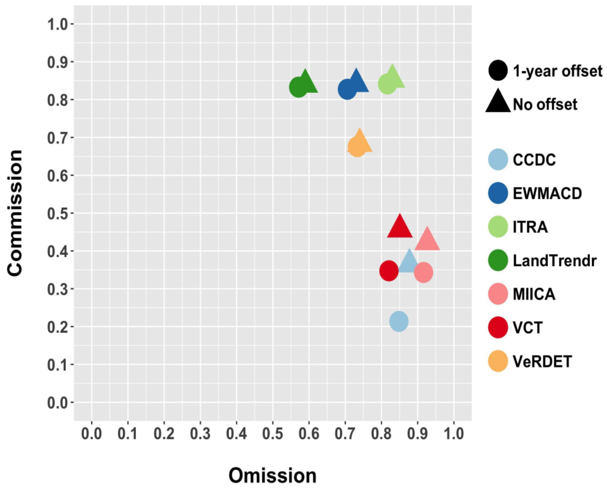

# Prerequisites

# Vegetation monitoring and disturbance detection

Presentation of change detection algorithms with focus on vegetation
disturbance.

## Objectives

After finishing this theme you will know the different approaches to
change detection and you will be able to select the most appropriate
algorithm and variable based on available data and study object.

## Existing algorithms

Freely available long time series of satellite data, such as Landsat,
have opened the way to the development of various change detection
algorithms. The literature presents different approaches to change
detection, as we listed in [Theme
2](../02_temporal_information/02_temporal_information.md)) highlighting
their possibility to detect particular change (abrupt, gradual,
seasonal). Here we would like to focus on the selected algorithms
strictly related to vegetation disturbance detection and explain to you
how they work.

Table 1 Selected change detection algorithms for vegetation disturbance
detection.

<b>Table 1. Selected algorithms for change detection on satellite
data.</b>

| Algorithm                                                                  | Algorithm purpose                                                                       | Description | Reference                                                            |
|----------------------------------------------------------------------------|-----------------------------------------------------------------------------------------|-------------|----------------------------------------------------------------------|
| VCT (Vegetation Change Tracker)                                            | Discrete events; limited range of disturbance magnitudes; forests only                  |             | [Huang et al., 2010](https://doi.org/10.1016/j.rse.2009.08.017)      |
| LandTrendr (Landsat-based detection of Trends in Disturbance and Recovery) | Discrete events and gradual trends; broad range of disturbance magnitudes; forests only |             | [Kennedy et al., 2010](https://doi.org/10.1016/j.rse.2010.07.008)    |
| BFAST (Breaks for Additive Season and Trend)                               |                                                                                         |             | [Verbesselt et al., 2010](https://doi.org/10.1016/j.rse.2009.08.014) |
| Image Trends from Regression Analysis (ITRA)                               | Gradual trends; broad range disturbance magnitudes; all woody vegetation                |             | [Vogelmann et al., 2012](https://doi.org/10.1016/j.rse.2011.06.027)  |
| MIICA (Multi-index Integrated Change Analysis)                             | Discrete events; limited range of disturbance magnitudes; all land cover types          |             | [Jin et al., 2013](https://doi.org/10.1016/j.rse.2013.01.012)        |
| EWMACD (Exponentially Weighted Moving Average Change Detection)            |                                                                                         |             | [Brooks et al., 2014](https://doi.org/10.1109/tgrs.2013.2272545)     |
| VeRDET (Vegetation Regeneration and Disturbance Estimates Through Time)    | Discrete events and gradual trends; broad range of disturbance magnitudes; forests only |             | [Hughes et al., 2017](https://doi.org/10.3390/f8050166)              |
| DBEST (Detecting breakpoints and estimating segments in trend)             |                                                                                         |             | [Jamali et al., 2014](https://doi.org/10.1016/j.rse.2014.09.010)     |
| CCDC (Continuous Change Detection and Classification)                      | Discrete events; limited range of disturbance magnitudes; all land cover types          |             | [Zhu, Woodcock, 2014](https://doi.org/10.1016/j.rse.2014.01.011)     |
| TSCCD (Time-Series Classification approach based on Change Detection)      |                                                                                         |             | [Yan et al., 2019](https://doi.org/10.1016/j.isprsjprs.2019.10.003)  |
| JUST (Jumps Upon Spectrum and Trend)                                       |                                                                                         |             | [Ghaderpour, Vujadinovic, 2020](https://doi.org/10.3390/rs12234001)  |
| TVCMA (Threshold and Trend based Vegetation Change Monitoring Algorithm)   | Discrete events and gradual trends; broad range of disturbance magnitudes; forests only |             | [Ochtyra et al., 2020](https://doi.org/10.1016/j.rse.2020.112026)    |

Time series Time series can consist of spectral bands, spectral indices
or results of data transformation for example Tasseled Cap. Selection of
used variables depends on the aim of analysis, available data and
algorithm. \* vegetation indices, spectral bands… TODO: comparison
between performance of different variables ([Cohen et al.,
2018](https://doi.org/10.1016/j.rse.2017.11.015)) ## Results validation
Preparation of validation dataset is a time consuming procedure but it
plays a key role in validation of time series analysis results. In Theme
2, we showed you how to create a validation dataset in the form of an
exercise. \* accuracy assessment

<b>Figure x. Omission and commission rates for each of the seven map
product sets ([Cohen et al.,
2017](https://doi.org/10.3390/f8040098)).</b>

## Methods

## Self-evaluation quiz

**Question 1.**

On what series of satellite data do bark beetle outbreaks appear?

1.  gradual  
2.  abrupt  
3.  phenological  
4.  all of the above

# References

Brooks, E. B., Wynne, R. H., Thomas, V. A., Blinn, C. E., & Coulston, J.
W. (2013). On-the-fly massively multitemporal change detection using
statistical quality control charts and Landsat data. IEEE Transactions
on Geoscience and Remote Sensing, 52(6),
3316-3332.https://doi.org/10.1109/tgrs.2013.2272545

Cohen, W. B., Healey, S. P., Yang, Z., Stehman, S. V., Brewer, C. K.,
Brooks, E. B., Gorelick, N., Huang, C., Hughes, M.J., Kennedy, R.E.,
Loveland, T.R., Moisen, G.G., Schroeder, T.A., Vogelmann, J.E.,
Woodcock, C.E., Yang, L., & Zhu, Z. (2017). How similar are forest
disturbance maps derived from different Landsat time series algorithms?.
Forests, 8(4), 98. <https://doi.org/10.3390/f8040098>

Cohen, W. B., Yang, Z., Healey, S. P., Kennedy, R. E., & Gorelick, N.
(2018). A LandTrendr multispectral ensemble for forest disturbance
detection. Remote sensing of environment, 205,
131-140.https://doi.org/10.1016/j.rse.2017.11.015

Ghaderpour, E., & Vujadinovic, T. (2020). Change detection within
remotely sensed satellite image time series via spectral analysis.
Remote Sensing, 12(23), 4001. <https://doi.org/10.3390/rs12234001>

Huang, C., Goward, S. N., Masek, J. G., Thomas, N., Zhu, Z., &
Vogelmann, J. E. (2010). An automated approach for reconstructing recent
forest disturbance history using dense Landsat time series stacks.
Remote Sensing of Environment, 114(1), 183-198.
<https://doi.org/10.1016/j.rse.2009.08.017>

Hughes, M. J., Kaylor, S. D., & Hayes, D. J. (2017). Patch-based forest
change detection from Landsat time series. Forests, 8(5), 166.
<https://doi.org/10.3390/f8050166>

Jamali, S., Jönsson, P., Eklundh, L., Ardö, J., & Seaquist, J. (2015).
Detecting changes in vegetation trends using time series segmentation.
Remote Sensing of Environment, 156, 182-195.
<https://doi.org/10.1016/j.rse.2014.09.010>

Jin, S., Yang, L., Danielson, P., Homer, C., Fry, J., & Xian, G. (2013).
A comprehensive change detection method for updating the National Land
Cover Database to circa 2011. Remote Sensing of Environment, 132,
159-175. <https://doi.org/10.1016/j.rse.2013.01.012>

Kennedy, R. E., Yang, Z., & Cohen, W. B. (2010). Detecting trends in
forest disturbance and recovery using yearly Landsat time series: 1.
LandTrendr—Temporal segmentation algorithms. Remote Sensing of
Environment, 114(12), 2897-2910.
<https://doi.org/10.1016/j.rse.2010.07.008>

Ochtyra, A., Marcinkowska-Ochtyra, A., & Raczko, E. (2020).
Threshold-and trend-based vegetation change monitoring algorithm based
on the inter-annual multi-temporal normalized difference moisture index
series: A case study of the Tatra Mountains. Remote Sensing of
Environment, 249, 112026. <https://doi.org/10.1016/j.rse.2020.112026>

Verbesselt, J., Hyndman, R., Newnham, G., & Culvenor, D. (2010).
Detecting trend and seasonal changes in satellite image time series.
Remote sensing of Environment, 114(1), 106-115.
<https://doi.org/10.1016/j.rse.2009.08.014>

Vogelmann, J. E., Xian, G., Homer, C., & Tolk, B. (2012). Monitoring
gradual ecosystem change using Landsat time series analyses: Case
studies in selected forest and rangeland ecosystems. Remote Sensing of
Environment, 122, 92-105. <https://doi.org/10.1016/j.rse.2011.06.027>

Yan, J., Wang, L., Song, W., Chen, Y., Chen, X., & Deng, Z. (2019). A
time-series classification approach based on change detection for rapid
land cover mapping. ISPRS Journal of Photogrammetry and Remote Sensing,
158, 249-262. <https://doi.org/10.1016/j.isprsjprs.2019.10.003>

Zhu, Z., & Woodcock, C. E. (2014). Continuous change detection and
classification of land cover using all available Landsat data. Remote
sensing of Environment, 144, 152-171.
<https://doi.org/10.1016/j.rse.2014.01.011>

## Exercise

Forest disturbance detection using Landsat time series using spectral
indices with LandTrendr.

### Next unit

You have finished all of themes in this module. You can now proceed with
case studies: \* [Monitoring tundra grasslands
(Karkonosze)](../06_cs_tundra_grasslands/06_cs_tundra_grasslands.md) \*
[Seasonal dynamics of vegetation in mountain ecosystems
(Karkonosze)](../07_cs_vegetation_dynamics/07_cs_vegetation_dynamics.md)
\* [Forest disturbance detection
(Tatras)](../08_cs_disturbance_detection/08_cs_disturbance_detection.md)
