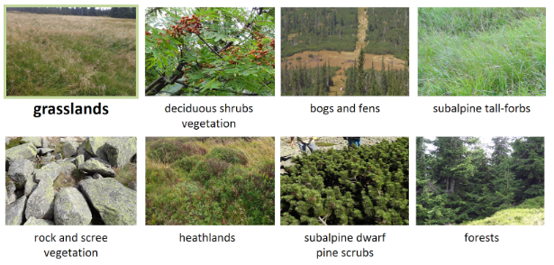

## Introduction

In this case study we will focus on classifying non-forest tundra
vegetation in higher parts of Karkonosze Mountains, laying on the
Polish-Czech border. The process will consist of extracting reference
data from multitemporal Sentinel-2 imagery and classifying it with
Support Vector Machine algorithm. Additional analysis will consist of
feature importance assessment performed for grasslands class as the main
object of the study.

### Study area

The area is located in Polish and Czech Karkonosze/Krkonoše Mountains
within the borders of national parks. The highest parts of mountains
cover two plant floors: subalpine (1250–1450 m a.s.l.), and alpine zone
(above 1450 m a.s.l.) and it is considered unique in this region of
arctic-alpine tundra. Examples of vegetation classes including
grasslands are presented below (**Figure 1**).

<p align="center">

</p>

<div align="center">

<b>Figure 1. Subalpine and alpine vegetation.</b>

</div>

The study area on a much more detailed scale will be explored in Module
4 on hyperspectral data (case study of the same name).

### Data

#### TO BE COMPLETED (to be decided: description of data here or when data is loaded into the environment)

## Getting started

### Environment preparation: loading required libraries and data

To start with, we want to load necessary libraries and data and set up
some initial variables, which we will use further down the line.

Firstly, load required libraries into the environment: rgdal, raster,
caret, and kernlab. Functions included in these packages will be used
further in this case study.

``` r
library(rgdal)
library(raster)
library(caret)
library(kernlab)
```

Now we can start with loading up the required data. We shall start with
the raster data. The imagery used in this case study are Sentinel-2
images collected in 2018 within the growing season (exact dates are 31
May, 7 August, 27 August and 18 September, June and July images were
unfortunately covered by clouds). In case of raster data there are two
ways you can approach this case study: use the attached preprocessed
data or go to ***–THIS TUTORIAL–*** to download raw data and preprocess
it to the desired state yourself. In any case load the data to the
variable *image*.

``` r
image <- brick("ABCD_stacked_res.bsq")
```

#### TO BE COMPLETED (to be decided: description of data preprocessing steps: masking clouds, shadows and water here, or in the tutorial)

Now add the vector reference data to our workspace. It consists of field
collected polygons with appropriate classes assigned, which will be used
to classify multitemporal Sentinel-2 images from 2018. Load .shp file to
the *reference* variable.

``` r
reference <- readOGR("reference_data.shp", "reference_data")
```

### Reference values extraction

The two main required data sources are now loaded into the workspace, so
we can proceed with preparing data for classification. First of all, we
need to extract pixel values from loaded images of areas covered by the
reference data. In order to do that we will use our own function, which
will assign each pixel in each polygon values from spectral bands of
Sentinel-2 imagery.

``` r
extract_px_val <- function(image, vector_reference, class_field_name){
  counter <- 1
  
  num_polygons <- NROW(vector_reference@data)
  obs_data <- data.frame()
  
  class_column_index <- which(names(vector_reference@data) == class_field_name)

  for (poly_ind in seq(num_polygons)) {
    s_f <- vector_reference@polygons[poly_ind]
    class <- vector_reference@data[poly_ind, class_column_index]
    s_f_SP <- SpatialPolygons(s_f)
    poly_px_vals <- extract(image, s_f_SP, df = TRUE)
    poly_px_vals <- cbind(poly_px_vals[ ,2: ncol(poly_px_vals)], class, poly_ind)
    obs_data <- rbind(obs_data, poly_px_vals)
    
    print(counter / num_polygons)
    counter <- counter + 1
  }
  return(obs_data)
}
```

Now we shall use the above function to extract the values with the data
from the reference dataset we loaded earlier.

``` r
pixel_reference <- extract_px_val(image, reference, "class")
```

We need to fix the column names in order to use them later.

``` r
fixed_names <- unlist(strsplit(names(pixel_reference)[1:40], "\\.."))
names(pixel_reference)[1:40] <- fixed_names[seq(1, length(fixed_names) ,by = 4)]
```

We now have all the data we need to proceed. We will start with
classifying single scenes, then multitemporal classification and end
with best features selected. Each classification will be performed using
the Support Vector Machine algorithm and radial as the kernel function,
which was preceded by tuning its parameters (see below).

### Classification scenario 1: single scene

We will start the single scene classification process with extracting
only Sentinel-2 bands values from the single scene. In case of the
earliest acquired image (31 May) these will be the first 10 columns of
the *pixel_reference* data frame, as well two last columns including
class names and polygon indices.

``` r
pixel_reference <- pixel_reference[c(1:10, 41,42)]
```

In order to make our work reproducible we shall set a common seed
number.

``` r
set.seed(1410)
```

We can now assess how many **pixel samples** for every class we acquired
during values extraction.

``` r
table(pixel_reference$class)
```

In comparison we can see how many **polygons** for each class.

``` r
table(reference@data$class)
```

In this part we will divide our reference dataset into training and
validation parts. We will divide the whole set into 2 parts of equal
number of polygons in each of 2 parts. Notice that the number of pixels
may be different in both sets due to differences in polygon sizes.

``` r
trainIndex <- createDataPartition(reference@data$class, p = 0.5, list = FALSE)

trainData <- pixel_reference[ pixel_reference$poly_ind %in% trainIndex, ]
valData <- pixel_reference[ !(pixel_reference$poly_ind %in% trainIndex), ]

table(trainData$class)
table(valData$class)
```

Now that we established the training and validation datasets we can
perform a step called tuning classification parameters. The classifier
chosen for this case study is Support Vector Machine.

#### TO BE COMPLETED (info about kernels, parameters make student understand what is happening below).

For determining best parameters we will use tenfold cross validation of
results achieved with different sets of predetermined parameters.

``` r
control <- trainControl(method="cv", number = 10)

tune_params <- data.frame(C = c(10,100,100), sigma = c(0.1, 0.5, 0.95))

model <- train( trainData[ , 1:10], trainData$class, method = "svmRadial", trControl = control,
                tuneGrid = tune_params)  

varImp(model)
plot(varImp(model))
```

We will now assess the accuracy of the model by applying it to the
validation dataset.

``` r
pred <- predict(model, valData[ , 1:10])
confusionMatrix(pred, valData$class, mode = "everything")
```

In this part of the exercise we will use the model to classify the
image. In order to do that we no need to extract the bands from the
multitemporal data brick, which were acquired on 30 May.

``` r
first_10_img <- subset(image, c(1:10))
names(first_10_img) <- names(trainData)[1:10]
```

And now we can apply the model to the appropriate 10 bands. This will
classify the image into the classes provided earlier with the reference
dataset.

``` r
raster:predict(first_10_img, model, filename = "A_SVM_cls.tif", progress = "text", format = "GTiff")
```

We have successfully classified 1 of the 4 images contained in the case
study data repository. Your task is now to go over necessary steps to
classify the remaining 3 images.

Hint: this is the code chunk where you choose the appropriate Sentinel-2
bands (pixel values) which are used for classification later on.

``` r
pixel_reference <- pixel_reference[c(first_band:last_band, 41,42)]
```

### Classification scenario 2: multitemporal set

### Other case studies

-   [Seasonal dynamics of vegetation in mountain ecosystems
    (Karkonosze)](../07_cs_vegetation_dynamics/07_cs_vegetation_dynamics.md)
-   [Forest disturbance detection
    (Tatras)](../08_cs_disturbance_detection/08_cs_disturbance_detection.md)

### Module themes

-   [Principles of multispectral
    imaging](../01_multispectral_principles/01_multispectral_principles.md)
-   [Temporal information in satellite
    data](../02_temporal_information/02_temporal_information.md)
-   [Image processing
    workflow](../03_image_processing/03_image_processing.md)
-   [Multitemporal classification of vegetation
    types](../04_multitemporal_classification/04_multitemporal_classification.md)
-   [Vegetation monitoring and disturbance
    detection](../05_vegetation_monitoring/05_vegetation_monitoring.md)
