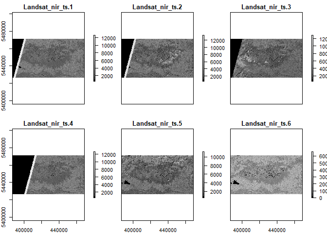
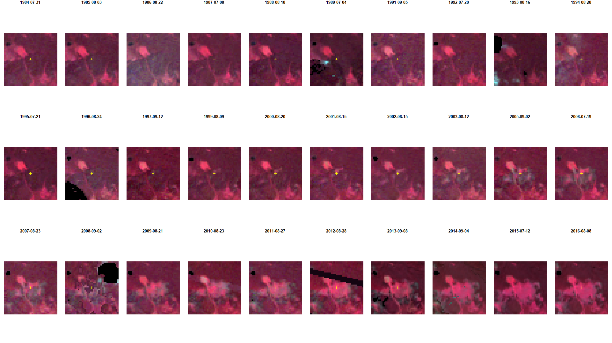
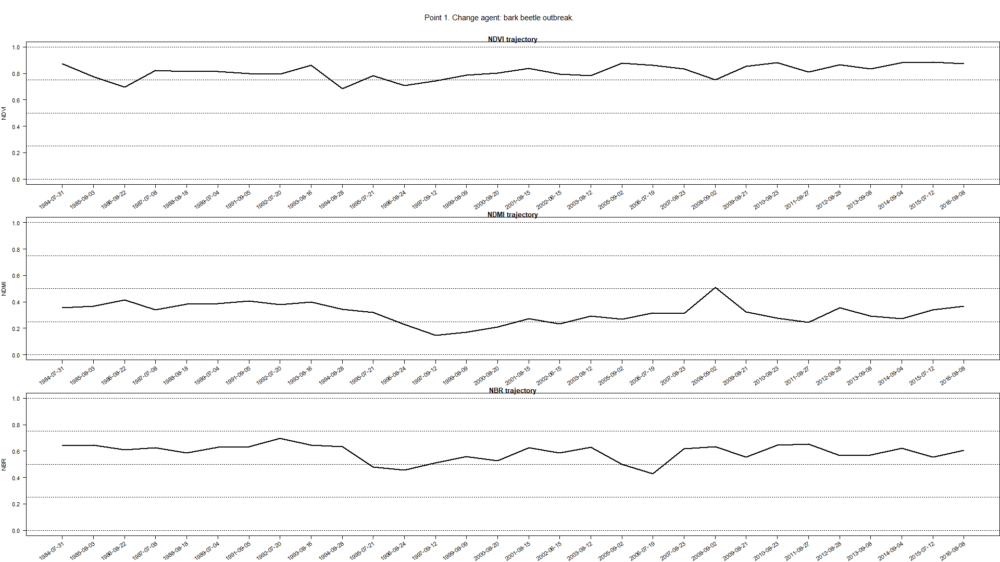
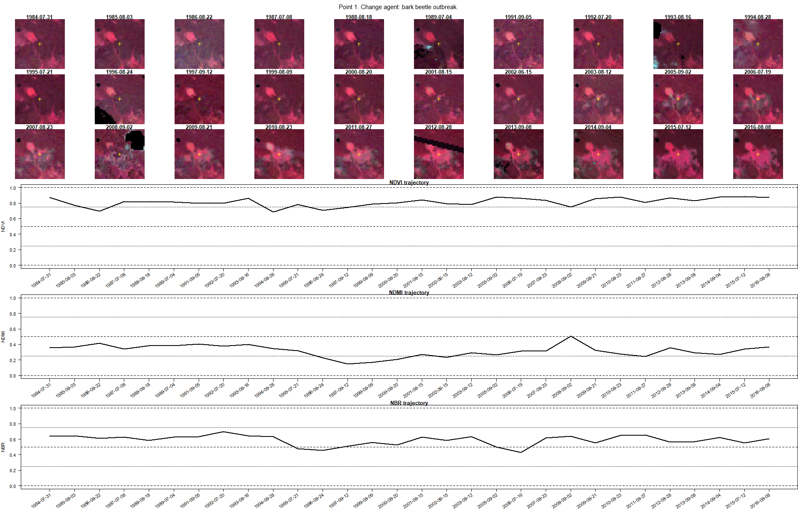

```{r setup, include=FALSE}
knitr::opts_chunk$set(echo = TRUE)
```

## Exercise

### Change moments and agents in Tatra Mountains

In this exercise you will be able to complete a few tasks: identifying **moments of changes** visible in the imagery as well as attributing **change agents** to detected moments based on trajectories of selected spectral indices.

The main objective of this exercise is not only to show you some examples of changes and change agents, but also to provide you with the ability to prepare your own reference data sets for different purposes on the basis of photointerpretation of imagery chips and charts presenting relationships of spectral indices values and changes happening on the ground.

#### Prerequisites

For this exercise you will need the following software, data and tools:

-   Software

    -   R with RStudio (additional libraries required: raster, sf, dplyr). You can access environment setup tutorial for the whole Module 2 here: -insert link to environment setup tutorial-

-   Data

    -   Downloaded data provided in the folder -link-

#### Data

The imagery provided for this exercise consists of Landsat (generations 5, 7 and 8) satellite imagery time series for 1984-2016 period. Generated time series consisted of images from summer period, defined asthe period between June 15 and Septemper 15. Images for each available year (years 1990, 1998 and 2004 were omitted due to low quality data - high cloud cover being the main reason for omittment) have been subjected to atmospheric and topographic correction using ATCOR 2/3 software. The results of corrections were validated with surface reflectance measurements collected in-situ. Images have also been harmonized to Landsat 8 surface reflectance values by linear regression obtained from comparison of clear pixel values among TM-ETM+ and ETM+-OLI sensors.

It should be noted that due to cloud cover in some periods, selected images (14/30) are composites of two different images. Composited were calculated using the higher NDVI value between two images.

```{css, echo=FALSE}

figcaption {
  text-align: center;
}
```

<figure>


<figcaption align="center">

<b>Left: Landsat 5 TM 31.07.1984, RGB 321; right: Landsat 8 OLI 8.09.2016, RGB 432</b>

</figcaption>

</figure>

Results of preprocessing were 30 6-band (corresponding to Landsat 5 bands 1-5 and 7) bricks, which in turn were used to calculate spectral indices. For this exercise, you will use 30-layer raster bricks of bands 4 (NIR), 3 (red) and 2 (green) for displaying the data and vector data with reference points. Points have assigned attributes regarding year of detected change, change agent and time series values of three spectral indices: NDVI, NDMI and NBR.

More information about the data and processing can be found in [Ochtyra et. al 2020](https://doi.org/10.1016/j.rse.2020.112026).

#### Environment preparation

To start with, we want to load neccessary libraries and data and set up some initial variables, which we will use further down the line.

Firstly, load required libraries into the environment: raster, sf, and dplyr.

```{r message = FALSE}
library(raster) # raster processing
library(sf) # vector and attributes handling
library(dplyr) # data manipulation
```

#### Loading data

Now we can load required data into RStudio environment. We will start with loading 3 raster bricks of bands green, red and NIR respectively.

```{r message = FALSE}
green <- brick("data_exercise/Landsat_green_ts.tif") # RasterBrick containing 30 green bands from 1984-2016 period
red <- brick("data_exercise/Landsat_red_ts.tif") # RasterBrick containing 30 red bands from 1984-2016 period
nir <- brick("data_exercise/Landsat_nir_ts.tif") # RasterBrick containing 30 NIR bands from 1984-2016 period
```

The bands in the raster bricks are ordered by date: first raster is the earliest acquired image from 1984 and the last is the raster from 2016.

We can visualize part of one of the bricks to see overall data extent and values of bands.

```{r message = FALSE, eval = FALSE}
plot(nir, 1:6, col = gray.colors(n = 16, start = 0)) # visualisation of first 6 bands (1984-1989)
```



We can now also add vector of dates assigned to each image. As mentioned previously, some images are composites. For them the date assigned is the date of main image, from which most of the pixels were used in the final composite.

```{r message = FALSE}
years <- as.Date(c("1984-07-31","1985-08-03","1986-08-22", "1987-07-08", "1988-08-18", "1989-07-04", "1991-09-05", "1992-07-20", "1993-08-16", "1994-08-28", "1995-07-21", "1996-08-24", "1997-09-12", "1999-08-09", "2000-08-20", "2001-08-15", "2002-06-15", "2003-08-12", "2005-09-02", "2006-07-19", "2007-08-23", "2008-09-02", "2009-08-21", "2010-08-23", "2011-08-27", "2012-08-28", "2013-09-08","2014-09-04", "2015-07-12", "2016-08-08")) # vector of dates assigned to subsequent rasters in the data brick
```

Now load reference points data into workspace. By using function for reading data from *sf* package we can easily read and manipulate data contained in the attribute table of vector file.

```{r message = FALSE, eval = FALSE}
points <- st_read("data_exercise/Tatra_Mountains_change_points.shp") # set of 9 reference points with attribute table
```

There are 9 points into reference layer with attributes of year of change detection, change agent and 90 spectral indices values (30 for each of NDVI, NDMI and NBR).

#### Visualising imagery chips and spectral trajectories

Now that we have all the required data we can prepare our plotting environment. Our goal is to overview so called image chips, which are parts of the images surrounding reference points. For now, we will use point number 1 as an example. In further part of the exercise we will create a loop to perform each step for all of the points.

Now we will pick one of the points and based on the coordinates we will outline the range of the chip. We will use chips which are 39x39 pixels in area.

```{r message = FALSE, eval = FALSE}
point_number <- 1 # indicate the number of point as read into the environment

point_cords <- st_coordinates(points)[point_number, ] # retrieve coordinates from point location

row <- colFromX(green, point_cords[1]) # retrieve image column, where the point lies
col <- rowFromY(green, point_cords[2]) # rerieve image row, where the point lies

window_size <- 39 # set up size of the image chip
half_widow_size <- floor(window_size / 2) # half of the window size
col_cords <- (col - half_widow_size) : (col + half_widow_size) # image columns, which will we used for image chip visualisation
row_cords <- (row - half_widow_size) : (row + half_widow_size) # image rows, which will we used for image chip visualisation
```

We set up output name of the chips mosaic and initialize device, which can be explained as a new plotting area, which will be saved to our disk after we finish drawing. We want to display chips in 3 rows, 10 columns. For that we will set up layout.

```{r message = FALSE, eval = FALSE}
output_name <- "chips_example.png" # set up output name of the file
png(filename = output_name, width = 1920, height = 1080, pointsize = 16) # initialize device, plotting area 1920x1080 px, size of plotted text 16 points

layout(matrix(seq(1,30),3, 10, byrow = TRUE), heights = c(1,1,1)) # plotting area set up as a 3x10 matrix
```

Now we can plot our chips. In the loop below we will use 3 raster bricks with NIR, red and green bands to create RGB NIR/RED/GREEN composites of outlined chips for selected point. To visualise each chips with similar parameters we will also trim histogram stretches to set values. For each chip we will also display date and location of selected point.

```{r message = FALSE, eval = FALSE}
for (j in seq(30)){ # loop 30 times - once for each raster in the brick
  
  o_b1 <- raster(matrix(getValuesBlock(green[[j]], 
                                       col = row_cords[1], nrows = window_size, row = col_cords[1],
                                       ncols = window_size),
                        nrow = window_size, ncol = window_size, byrow = TRUE)) # prepare image slice from the appropriate green raster using parameters prepared previously
  
  o_b2 <- raster(matrix(getValuesBlock(red[[j]],
                                       col = row_cords[1], nrows = window_size, row = col_cords[1],
                                       ncols = window_size),
                        nrow = window_size, ncol = window_size, byrow = TRUE)) # prepare image slice the appropriate red raster using parameters prepared previously
  
  o_b3 <- raster(matrix(getValuesBlock(nir[[j]],
                                       col = row_cords[1], nrows = window_size, row = col_cords[1],
                                       ncols = window_size),
                        nrow = window_size, ncol = window_size, byrow = TRUE)) # prepare image slice from the appropriate NIR raster using parameters prepared previously
  
  
  b_min <- 10
  b_max <- 1000
  o_b1 <- (o_b1 - b_min) / (b_max - b_min) * 255 # trim histogram of green band for harmonized viewing of the whole set
  
  b_min <- 10
  b_max <- 1000
  o_b2 <- (o_b2 - b_min) / (b_max - b_min) * 255 # trim histogram of red band for harmonized viewing of the whole set
  
  b_min <- 10
  b_max <- 4000
  o_b3 <- (o_b3 - b_min) / (b_max - b_min) * 255 # trim histogram of NIR band for harmonized viewing of the whole set
  
  
  o_b1[o_b1 < 0] <- 0 
  o_b2[o_b2 < 0] <- 0 # convert any negative values to 0 for better viewing
  o_b3[o_b3 < 0] <- 0
  
  par(mar = c(0,1,1,1)) # set up margins around each of 30 plotting blocks
  
  plotRGB(brick(o_b3, o_b2, o_b1), axes = FALSE, margins = TRUE, xlab = "", ylab= "", main = years[j]) # plot RGB chip in the appropriate place in the layout, show date of the image acquisition
  points(0.5,0.5, pch = 3, lwd = 1, col = c("yellow")) # draw the location of reference point 
}

dev.off() # turn off the device - save .png image to working directory
```

This is the result of running the code above.



As you can see we managed to plot the whole timeseries in one image, which allows for easier visual comparison of the images.

Now we will plot values for 3 spectral indices. We need to prepare our plotting area in a different way to previous plot. Additionally we need to prepare numerical data. For each spectral index we extract 30 values from attribute table.

```{r message = FALSE, eval = FALSE}
output_name = "trajectory_example.png" # set up output name of the file
png(filename = output_name, width = 1920, height = 1080, pointsize = 16)

layout(matrix(seq(1, 4), 4, 1, byrow = TRUE), heights = c(0.25, 1.25, 1.25, 1.25)) # plotting area set up as a 4x1 matrix, which will present as 3 long spanning over the whole plotting area

par(mar = c(0, 0, 0, 0)) # the first element of the plot - title; we begin by setting margins of part of the plot 
plot.new() # new element in the plot, in this case title
text(0.5, 0.5, paste0("Point ", point_number, ". Change agent: ", points$chng_agent[point_number], "."), cex = 1.4, font = 1) # title will contain point number and change agent retrieved from attribute table

par(mar = c(4, 4, 1, 0)) # new margins to use for the rest of the plot

ndvi_vals <- points[point_number, ] %>% # in this fragment we retrieve spectral index values from attribute table of vector file
  st_drop_geometry() %>% # we use pipe operator to perform several actions; first we pick the desired point from the vector file
  select(NDVI_1984:NDVI_2016) %>% # then we extract just the attribute table and select only spectral index values
  unlist(., use.names = FALSE)  # in the end we create a vector of values to plot 


plot(ndvi_vals, type = "l", ylab = "NDVI", lwd = 2, xlab = "",
     main = "NDVI trajectory",
     ylim = c(0, 1), xaxt = "n", las = 1) # we initiate a line plot of index values
axis(1, at=1:30, labels = FALSE) 
text(x=1:30, y=-0.09, labels=years, srt=35, adj=1, xpd = TRUE, cex = 1, font = 1) # two next lines are for tilted x-axis labels
abline(h = 0, lty = 2)
abline(h = 1, lty = 2)
abline(h = 0.5, lty = 2)
abline(h = 0.25, lty = 3)
abline(h = 0.75, lty = 3) # we can also add some lines in the plot to ease the reading


# now we repeat the above steps to plot the remaining two trajectories

ndmi_vals <- points[point_number, ] %>%
  st_drop_geometry() %>%
  select(NDMI_1984:NDMI_2016) %>%
  unlist(., use.names = FALSE)

plot(ndmi_vals, type = "l", ylab = "NDMI", lwd = 2, xlab = "",
     main = "NDMI trajectory",
     ylim = c(0, 1), xaxt = "n", las = 1)
axis(1, at=1:30, labels = FALSE)
text(x=1:30, y=-0.09,
     labels=years, srt=35, adj=1, xpd = TRUE, cex = 1, font = 1)
abline(h = 0, lty = 2)
abline(h = 1, lty = 2)
abline(h = 0.5, lty = 2)
abline(h = 0.25, lty = 3)
abline(h = 0.75, lty = 3)

###

nbr_vals <- points[point_number, ] %>%
  st_drop_geometry() %>%
  select(NBR_1984:NBR_2016) %>%
  unlist(., use.names = FALSE)

plot(nbr_vals, type = "l", ylab = "NBR", lwd = 2, xlab = "",
     main = "NBR trajectory",
     ylim = c(0, 1), xaxt = "n", las = 1)
axis(1, at=1:30, labels = FALSE)
text(x=1:30, y=-0.09,
     labels=years, srt=35, adj=1, xpd = TRUE, cex = 1, font = 1)
abline(h = 0, lty = 2)
abline(h = 1, lty = 2)
abline(h = 0.5, lty = 2)
abline(h = 0.25, lty = 3)
abline(h = 0.75, lty = 3)


dev.off() # turn off the device - save .png image to working directory
```

The result of the above chunk of code should look like this.



Now we can automate our processing by looping previous functions and merging two output images into one containing both chips and trajectories into one image. Most of the code will remain similar with a few modifications needed for the loop to work properly. Changed code line will be indicated by comments in the code chunk.

```{r message = FALSE, eval = FALSE}
window_size <- 39 # set up window size for all elements which will come out of the loop

for (i in seq(nrow(points))){ # the loop will last till all of the points in the layer are used
  
  
  point_cords <- st_coordinates(points)[i, ] 
  row <- colFromX(green, point_cords[1])
  col <- rowFromY(green, point_cords[2])
  
  half_widow_size <- floor(window_size / 2)
  col_cords <- (col - half_widow_size) : (col + half_widow_size)
  row_cords <- (row - half_widow_size) : (row + half_widow_size)
  
  output_name <- paste0("Point ", i, ". ", points$chng_agent[i], ".png") # name of the file will contain information about point number and change agent
  
  png(filename = output_name, width = 1920, height = 1080, pointsize = 16)
  
  layout(matrix(c(rep(1, 10), seq(2, 31), rep(32, 10), rep(33, 10), rep(34, 10)),
                7, 10, byrow = TRUE), heights = c(0.25, 1, 1, 1, 2, 2, 2)) # plot area divided into more parts to fit all of the components
  
  par(mar = c(0, 0, 0, 0))
  plot.new()
  text(0.5, 0.5, paste0("Point ", i, ". Change agent: ", points$chng_agent[i], "."), cex = 1.4, font = 1)
  
  par(mar = c(0,0,1,0))
  for (j in seq(30)){
    
    o_b1 <- raster(matrix(getValuesBlock(green[[j]], 
                                         col = row_cords[1], nrows = window_size, row = col_cords[1],
                                         ncols = window_size),
                          nrow = window_size, ncol = window_size, byrow = TRUE))
    
    o_b2 <- raster(matrix(getValuesBlock(red[[j]],
                                         col = row_cords[1], nrows = window_size, row = col_cords[1],
                                         ncols = window_size),
                          nrow = window_size, ncol = window_size, byrow = TRUE))
    
    o_b3 <- raster(matrix(getValuesBlock(nir[[j]],
                                         col = row_cords[1], nrows = window_size, row = col_cords[1],
                                         ncols = window_size),
                          nrow = window_size, ncol = window_size, byrow = TRUE))
    
    
    b_min <- 10
    b_max <- 1000
    o_b1 <- (o_b1 - b_min) / (b_max - b_min) * 255
    
    b_min <- 10
    b_max <- 1000
    o_b2 <- (o_b2 - b_min) / (b_max - b_min) * 255
    
    b_min <- 10
    b_max <- 4000
    o_b3 <- (o_b3 - b_min) / (b_max - b_min) * 255
    
    
    o_b1[o_b1 < 0] <- 0
    o_b2[o_b2 < 0] <- 0
    o_b3[o_b3 < 0] <- 0
    
    par(mar = c(0,0,1,0))
    plotRGB(brick(o_b3, o_b2, o_b1), axes = FALSE, margins = TRUE,
            xlab = "", ylab= "", main = years[j])
    points(0.5,0.5, pch = 3, lwd = 1, col = c("yellow"))
  }
  
  ###
  par(mar = c(4, 4, 1, 0))
  
  ndvi_vals <- points[i, ] %>%
    st_drop_geometry() %>%
    select(NDVI_1984:NDVI_2016) %>%
    unlist(., use.names = FALSE)
  
  
  plot(ndvi_vals, type = "l", ylab = "NDVI", lwd = 2, xlab = "",
       main = "NDVI trajectory",
       ylim = c(0, 1), xaxt = "n", las = 1)
  axis(1, at=1:30, labels = FALSE)
  text(x=1:30, y=-0.1,
       labels=years, srt=35, adj=1, xpd = TRUE, cex = 1, font = 1)
  abline(h = 0, lty = 2)
  abline(h = 1, lty = 2)
  abline(h = 0.5, lty = 2)
  abline(h = 0.25, lty = 3)
  abline(h = 0.75, lty = 3)
  
  ###
  
  ndmi_vals <- points[i, ] %>%
    st_drop_geometry() %>%
    select(NDMI_1984:NDMI_2016) %>%
    unlist(., use.names = FALSE)
  
  plot(ndmi_vals, type = "l", ylab = "NDMI", lwd = 2, xlab = "",
       main = "NDMI trajectory",
       ylim = c(0, 1), xaxt = "n", las = 1)
  axis(1, at=1:30, labels = FALSE)
  text(x=1:30, y=-0.1,
       labels=years, srt=35, adj=1, xpd = TRUE, cex = 1, font = 1)
  abline(h = 0, lty = 2)
  abline(h = 1, lty = 2)
  abline(h = 0.5, lty = 2)
  abline(h = 0.25, lty = 3)
  abline(h = 0.75, lty = 3)
  
  ###
  nbr_vals <- points[i, ] %>%
    st_drop_geometry() %>%
    select(NBR_1984:NBR_2016) %>%
    unlist(., use.names = FALSE)
  
  plot(nbr_vals, type = "l", ylab = "NBR", lwd = 2, xlab = "",
       main = "NBR trajectory",
       ylim = c(0, 1), xaxt = "n", las = 1)
  axis(1, at=1:30, labels = FALSE)
  text(x=1:30, y=-0.1,
       labels=years, srt=35, adj=1, xpd = TRUE, cex = 1, font = 1)
  abline(h = 0, lty = 2)
  abline(h = 1, lty = 2)
  abline(h = 0.5, lty = 2)
  abline(h = 0.25, lty = 3)
  abline(h = 0.75, lty = 3)
  
  dev.off()
  
}

```

All of the resulting images should be looking like the example below.



Now analyze the resulting 9 images. Focus on recognizing changes visible in the chips; try to find the year of change based on the visual interpretation and compare your guess to the date in the attribute table. Another thing you should try to do is assigning change agent to the spectral index, in which the change moment is mostly visible. That should be helpful in the last part of this exercise, in which you will try to recognize the date of change and assign the change agent to it by yourself.

TO DO: - load new vector file with several points for self-training - prepare modified code chunk - prepare questions and link to the correct answers - link to quiz question with image
