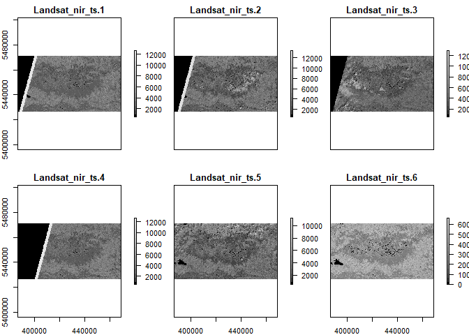
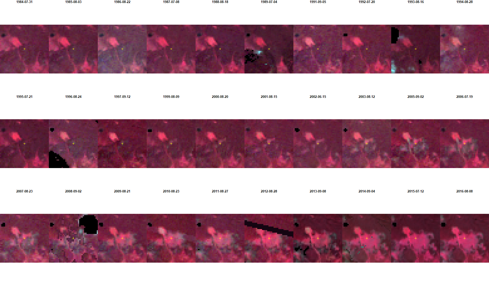
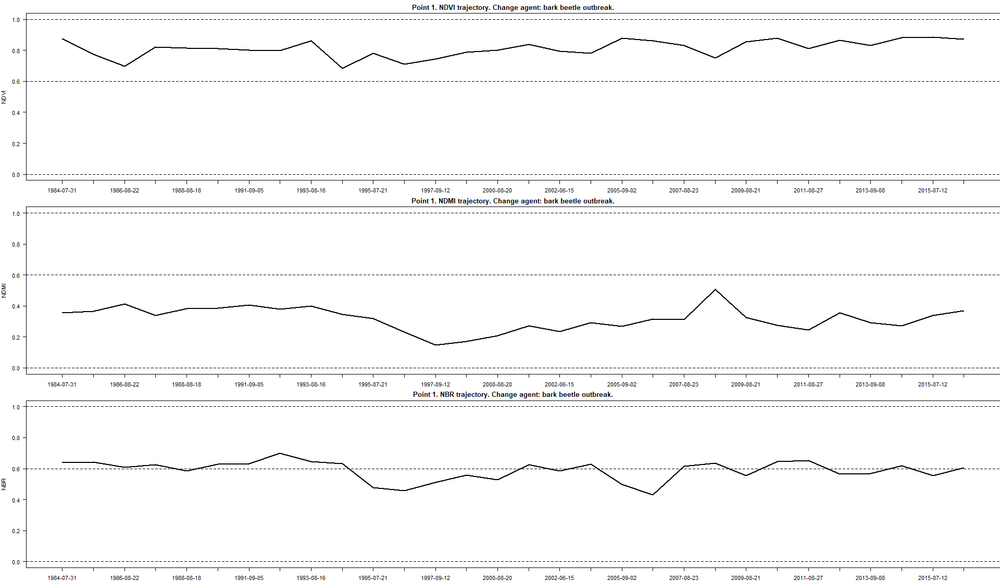

## Exercise

### Change moments and agents in Tatra Mountains

In this exercise you will be able to train identifying moments of
changes visible in the imagery as well as attributing change agents to
detected moments based on trajectories of selected spectral indices.

The main objective of this exercise is to provide you with the ability
to prepare your own reference data sets for different purposes on the
basis of photointerpretation of imagery chips and charts presenting
relationships of spectral indices values and changes happening on the
ground.

#### Prerequisites

For this exercise you will need the following software, data and tools:

-   Software

    -   R with RStudio (additional libraries required: raster, sf,
        dplyr) \[link\]

-   Data

    -   Downloaded data provided in the folder \[link\]

#### Data

The imagery provided for this exercise consists of Landsat (generations
5, 7 and 8) satellite imagery time series for 1984-2016 period. Images
for each available year (years 1990, 1998 and 2004 were omitted due to
high quality imagery) have been subjected to radiometric, atmospheric
and topographic corrections. Images have also been harmonised to Landsat
8 surface reflectance values.

\[insert Tatra Mountains RGB imagery\]

Results of preprocessing were 30 6-band (corresponding to Landsat 5
bands 1-5 and 7) bricks, which in turn were used to calculate spectral
indices. For this exercise, you will use 30-layer raster bricks of bands
4 (NIR), 3 (red) and 2 (green) for displaying the data and vector data
with reference points. Points have assigned attributes regarding year of
detected change, change agent and time series values of three spectral
indices: NDVI, NDMI and NBR.

More information about the data used can be found in: \[Phd dissertation
link\] and \[RSoE article link\].

#### Environment preparation

To start with, we want to load neccessary libraries and data and set up
some initial variables, which we will use further down the line.

Firstly, load required libraries: raster, sf, and dplyr.

    library(raster)
    library(sf)
    library(dplyr)

Now we can load required data into RStudio environment. We will start
with loading 3 raster bricks of bands green, red and NIR respectively.

    green <- brick("data_exercise/Landsat_green_ts.tif")
    red <- brick("data_exercise/Landsat_red_ts.tif")
    nir <- brick("data_exercise/Landsat_nir_ts.tif")

We can visualize part of one of the bricks to see overall data extent
and values of bands.

    plot(nir, 1:6, col = gray.colors(n = 16, start = 0))

We can now also add vector of dates assigned to each image. It should be
noted that selected images are mosaics of two different images. For them
the date assigned is the date of “main” image, which was filled by
“secondary” image.

    years <- as.Date(c("1984-07-31","1985-08-03","1986-08-22", "1987-07-08", "1988-08-18", "1989-07-04", "1991-09-05", "1992-07-20", "1993-08-16", "1994-08-28", "1995-07-21", "1996-08-24", "1997-09-12", "1999-08-09", "2000-08-20", "2001-08-15", "2002-06-15", "2003-08-12", "2005-09-02", "2006-07-19", "2007-08-23", "2008-09-02", "2009-08-21", "2010-08-23", "2011-08-27", "2012-08-28", "2013-09-08","2014-09-04", "2015-07-12", "2016-08-08"))

Now load reference points data into workspace.

    points <- st_read("data_exercise/Tatra_Mountains_change_points.shp")

    ## Reading layer `Tatra_mountains_change_points' from data source `F:\ETR\rmd\data_exercise\Tatra_mountains_change_points.shp' using driver `ESRI Shapefile'
    ## Simple feature collection with 9 features and 95 fields
    ## Geometry type: POINT
    ## Dimension:     XY
    ## Bounding box:  xmin: 403183.7 ymin: 5443350 xmax: 430199.1 ymax: 5460061
    ## Projected CRS: WGS 84 / UTM zone 34N

There are 9 points into reference layer with attributes of year of
change detection, change agent and 90 spectral indices values (30 for
each of NDVI, NDMI and NBR).

Now that we have all the required data we can prepare our plotting
environment. Our goal is to overview so called chips, which are parts of
the images surrounding reference points. For now, we will use point
number 1 as an example. In further part of the exercise we will create a
loop to perform each step for all of the points.

Now we will pick one of the points and based on the coordinates we will
outline the range of the chip. We will use chips which are 39x39 pixels
in area.

    point_number <- 1

    point_cords <- st_coordinates(points)[point_number, ]

    row <- colFromX(green, point_cords[1])
    col <- rowFromY(green, point_cords[2])

    window_size <- 39
    half_widow_size <- floor(window_size / 2)
    col_cords <- (col - half_widow_size) : (col + half_widow_size)
    row_cords <- (row - half_widow_size) : (row + half_widow_size)

We initialize device, which can be explained as a new plotting area. We
want to display chips in 3 rows, 10 columns. For that we will set up
layout.

    dev.new(width = 1920, height = 1080, unit = "px")
    layout(matrix(seq(1,30), 3, 10, byrow = TRUE), heights = c(2,2,2))

Now we can plot our chips. In the loop below we will use 3 raster bricks
with NIR, red and green bands to create RGB NIR/RED/GREEN composites of
outlined chips for selected point. To visualise each chips with similar
parameters we will also trim histogram stretches to set values. For each
chip we will also display date and location of selected point.

    for (j in seq(30)){
      
      o_b1 <- raster(matrix(getValuesBlock(green[[j]], 
                                           col = row_cords[1], nrows = window_size, row = col_cords[1],
                                           ncols = window_size),
                            nrow = window_size, ncol = window_size, byrow = TRUE))
      
      o_b2 <- raster(matrix(getValuesBlock(red[[j]],
                                           col = row_cords[1], nrows = window_size, row = col_cords[1],
                                           ncols = window_size),
                            nrow = window_size, ncol = window_size, byrow = TRUE))
      
      o_b3 <- raster(matrix(getValuesBlock(nir[[j]],
                                           col = row_cords[1], nrows = window_size, row = col_cords[1],
                                           ncols = window_size),
                            nrow = window_size, ncol = window_size, byrow = TRUE))
      
      
      b_min <- 10
      b_max <- 1000
      # range <- b_max - b_min
      o_b1 <- (o_b1 - b_min) / (b_max - b_min) * 255
      
      b_min <- 10
      b_max <- 1000
      # range <- b_max - b_min
      o_b2 <- (o_b2 - b_min) / (b_max - b_min) * 255
      
      b_min <- 10
      b_max <- 4000
      # range <- b_max - b_min
      o_b3 <- (o_b3 - b_min) / (b_max - b_min) * 255
      
      
      o_b1[o_b1 < 0] <- 0
      o_b2[o_b2 < 0] <- 0
      o_b3[o_b3 < 0] <- 0
      
      par(mar = c(0,0,1,0))
      plotRGB(brick(o_b3, o_b2, o_b1), axes = FALSE, margins = TRUE,
              xlab = "", ylab= "", main = years[j])
      points(0.5,0.5, pch = 3, lwd = 1, col = c("yellow"))
    }

This is result example.

    Now we will plot values for 3 spectral indices. We need to prepare our plotting area in a different way to previous plot. Additionally we need to prepare numerical data. For each spectral index we extract 30 values from attribute table.

    dev.new(width = 1920, height = 1080, unit = "px")

    layout( matrix(seq(1,3), 3, 1, byrow = TRUE), heights = c(1,1,1) )

    par(mar = c(2,4,2,0))

    ndvi_vals <- points[point_number, ] %>%
      st_drop_geometry() %>%
      select(NDVI_1984:NDVI_2016) %>%
      unlist(., use.names = FALSE)

    plot(ndvi_vals, type = "l", ylab = "NDVI", lwd = 2, xlab = "Year",
         main = paste0("Point ", point_number, ". NDVI trajectory. Change agent: ", points$chng_agent[point_number], "."),
         ylim = c(0, 1), xaxt = "n", las = 1)
    axis(1, at=1:30, labels = years)
    abline(h = 0, lty = 2)
    abline(h = 1, lty = 2)
    abline(h = 0.6, lty = 2)

    ###

    ndmi_vals <- points[point_number, ] %>%
      st_drop_geometry() %>%
      select(NDMI_1984:NDMI_2016) %>%
      unlist(., use.names = FALSE)

    plot(ndmi_vals, type = "l", ylab = "NDMI", lwd = 2, xlab = "Year",
         main = paste0("Point ", point_number, ". NDMI trajectory. Change agent: ", points$chng_agent[point_number], "."),
         ylim = c(0, 1), xaxt = "n", las = 1)
    axis(1, at=1:30, labels = years)
    abline(h = 0, lty = 2)
    abline(h = 1, lty = 2)
    abline(h = 0.6, lty = 2)

    ###
    nbr_vals <- points[point_number, ] %>%
      st_drop_geometry() %>%
      select(NBR_1984:NBR_2016) %>%
      unlist(., use.names = FALSE)

    plot(nbr_vals, type = "l", ylab = "NBR", lwd = 2, xlab = "Year",
         main = paste0("Point ", point_number, ". NBR trajectory. Change agent: ", points$chng_agent[point_number], "."),
         ylim = c(0, 1), xaxt = "n", las = 1)
    axis(1, at=1:30, labels = years)
    abline(h = 0, lty = 2)
    abline(h = 1, lty = 2)
    abline(h = 0.6, lty = 2)

This is the result.

Now we can automate our processing by looping previous functions and
merging two output images into 1…
